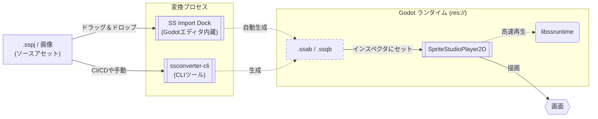

[**日本語**](./README.ja.md) | [**English**](./README.md)

# SpriteStudioPlayer for Godot

本developブランチは現在開発中のバージョンです。  
安定版は [mainブランチ](https://github.com/SpriteStudio/SSPlayerForGodot/tree/main) または、[Releases](https://github.com/SpriteStudio/SSPlayerForGodot/releases)から取得してください。  

> **注意:** 本書で扱う API・ワークフローは現在開発中のため、予告なく変更される可能性があります。また、本ブランチに関していかなる保証もサポートも提供せず、リクエストやバグ報告への返信もできません。

[OPTPiX SpriteStudio 7](https://www.webtech.co.jp/spritestudio/) で作成したアニメーションを [Godot Engine](https://godotengine.org/) 上で再生するためのハイパフォーマンスなプラグインです。
このプラグインを使用することで、ラスターベースの2Dアニメーションを Godot プロジェクトへ簡単に実装・再生することができます。

## ドキュメント

詳細な使い方は `docs/` フォルダ内のドキュメントを参照してください。

- [**ドキュメント (日本語)**](./docs/ja/index.md)
- [**Documentation (English)**](./docs/en/index.md)

### クイックリンク (日本語)
- [インストール](./docs/ja/setup/install.md)
- [基本的な使い方](./docs/ja/workflow/usage_basic.md)
- [エディタ連携とアセットイテレーション](./docs/ja/workflow/usage_asset_pipeline.md)
- [スクリプト制御とイベント](./docs/ja/workflow/usage_scripting.md)
- [CLI コンバートと自動化](./docs/ja/workflow/import.md)
- [パフォーマンスと高度な設定](./docs/ja/workflow/tips.md)
- [ビルドガイド](./docs/ja/setup/build.md)
- [v1.x からのマイグレーション](./docs/ja/migration_from_v1.md)

## GDExtension を用いたクイックスタート

初めての方向けに、サンプルプロジェクトを使用した動作確認と、ご自身のプロジェクトへ導入する手順の2つを用意しています。

### 1. サンプルで動作確認する

1. **Godot Engine の準備**: [公式サイト](https://godotengine.org/download/) から 4.6 系のエディタをダウンロードします。
2. **GDExtension の取得**: [Releases](https://github.com/SpriteStudio/SSPlayerForGodot/releases) から最新パッケージをダウンロードし、展開します。
3. **サンプルの準備**: 取得した `addons` フォルダを、本リポジトリの `[examples/Ringo](./examples/Ringo)` フォルダ内にコピーします。
4. **確認**: Godot Engine で `[examples/Ringo](./examples/Ringo)` プロジェクトを開き、`Ringo.tscn` を開くことですぐにアニメーションの動作を確認できます。

### 2. 自身のプロジェクトへ導入する

1. **配置**: 取得した `addons` フォルダを、ご自身の Godot プロジェクトのルートにコピーします。
2. **インポート**: `.sspj` を Godot エディタにドラッグ＆ドロップして `.ssab` へ変換します。
3. **再生**: `SpriteStudioPlayer2D` ノードを追加し、`SSAB Resource` プロパティに生成された `.ssab` を指定します。

詳細は [インストールガイド](./docs/ja/setup/install.md) を参照してください。

## 概要 (Overview)

本プラグインは、**SpriteStudio と Godot エディタをシームレスに行き来できる強力なアセットパイプライン**を備え、一瞬でアセットを更新することが可能です。詳しくは [エディタ連携とアセットイテレーション](./docs/ja/workflow/usage_asset_pipeline.md) をご覧ください。

SpriteStudio のソースアセットから Godot で再生されるまでの基本的なデータフローは以下の通りです。

1.  **ソースアセット**: SpriteStudio 7 で作成されたアニメーションは `.sspj`（プロジェクト）、`.ssae`（アニメ）、`.ssce`（セルマップ）および画像として構成されます。
2.  **変換 (Conversion)**: Godot での高速な再生を実現するため、専用の **SS Import Dock**（エディタ内蔵）または **ssconverter-cli** を使用して、最適化されたバイナリ形式（`.ssab` / `.ssqb`）に変換します。
3.  **Godot ランタイム**: 生成されたバイナリを `SSABResource` として読み込み、`SpriteStudioPlayer2D` ノードを通じて再生します。内部では `libssruntime` が高速なレンダリング処理を行います。

## サンプル

[examples フォルダ](./examples/) に SDK のテストプロジェクトに基づいたサンプルプロジェクトがあります。

- [Ringo](./examples/Ringo) — 「りんご」のテスト
- [allAttributeV7](./examples/allAttributeV7) — 全属性の機能テスト
- [allPartsV7](./examples/allPartsV7) — 全パーツ種の機能テスト
- [overall](./examples/overall) — 総合的な機能テスト
- [overall_gdextension](./examples/overall_gdextension) — GDExtension 版での総合テスト
- [ParticleEffect](./examples/ParticleEffect) — エフェクト機能のテスト

## 関連リポジトリ

- [SpriteStudio7-SDK](https://github.com/SpriteStudio/SpriteStudio7-SDK) — `libssruntime` / `libssconverter` を提供する SDK 本体

## ライセンス

[LICENSE.txt](./LICENSE.txt) を参照してください。
