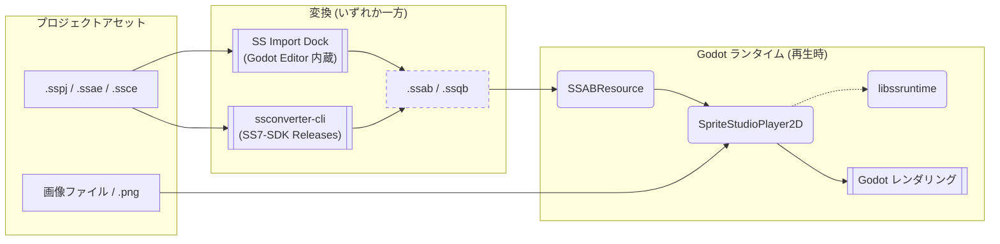

[**日本語**](./README.ja.md) | [**English**](./README.md)

# SpriteStudioPlayer for Godot

本developブランチは現在開発中のバージョンです。  
安定版は [mainブランチ](https://github.com/SpriteStudio/SSPlayerForGodot/tree/main) または、[Releases]([url](https://github.com/SpriteStudio/SSPlayerForGodot/releases))から取得してください。  
本developブランチに関してはいかなる保証もサポートも提供しません。リクエストやバグ報告への返信もできません。  
インターフェースは予告なく変更される可能性があります。v1.x からの移行手順は別途マイグレーションドキュメントを用意予定です。

[OPTPiX SpriteStudio](https://www.webtech.co.jp/spritestudio/) で作成したアニメーションを [Godot Engine](https://godotengine.org/) 上で再生するためのプラグインです。
再生処理は [SpriteStudio7-SDK](https://github.com/SpriteStudio/SpriteStudio7-SDK) が提供する `libssruntime` を介して行います。

## 概要 (Overview)

本プラグインを利用してアニメーションを再生する際の流れを以下に示します。

> **図の凡例**
> - **図形**: `[ ]` データ/ファイル, `( )` ライブラリ/コンポーネント, `[[ ]]` ツール/アプリケーション
> - **矢印**: `-->` データの流れ, `-.->` 依存/参照
> - **枠線**: 点線枠は生成されたファイルを示します。

`.sspj` → `.ssab` / `.ssqb` への変換は2通りの方法があり、いずれの方法で生成したファイルも同じく `SSABResource` / `SSQBResource` として Godot から読み込めます。詳細は [USAGE.ja.md](./USAGE.ja.md) を参照してください。

- ノード
    - `SpriteStudioPlayer2D`: SS アニメーションを再生する `Node2D` ベースのノード。
- リソース
    - `SSABResource`: 変換後のアニメバイナリ (`.ssab`) を表すリソース。
    - `SSQBResource`: 変換後のシーケンスバイナリ (`.ssqb`) を表すリソース。
- エディタ拡張
    - `SS Import Dock`: `.sspj` を `libssconverter` で `.ssab` / `.ssqb` へ変換するインポートコントロール。

## 対応バージョン

- **Godot Engine**: [4.6 ブランチ](https://github.com/godotengine/godot/tree/4.6)
- **godot-cpp**: [4.5 ブランチ](https://github.com/godotengine/godot-cpp/tree/4.5)

Windows / macOS でのビルドおよび実行を確認しています。

## クイックスタート

ビルド済みの GDExtension を取得して動かす最短手順です。

### 1. Godot Engine の準備

[公式サイト](https://godotengine.org/download/) から 4.6 系のエディタをダウンロードしてインストールします。

### 2. SSPlayerForGodot GDExtension の取得

[SSPlayerForGodot の Releases ページ](https://github.com/SpriteStudio/SSPlayerForGodot/releases) から該当プラットフォーム向けの GDExtension 一式をダウンロードします。

### 3. プロジェクトへの配置

ダウンロードした GDExtension 一式（ZIP 内の `addons` フォルダ）を Godot プロジェクトのルートディレクトリにコピーします。
正しく配置されると、`res://addons/spritestudio/spritestudio.gdextension` が存在する状態になります。
Godot エディタを再起動すると `SpriteStudioPlayer2D` ノードや SS Import Dock が利用可能になります。

### 4. SpriteStudio データの変換と再生

`.sspj` の変換から `SpriteStudioPlayer2D` での再生まで一通りの利用方法は [USAGE.ja.md](./USAGE.ja.md#spritestudio-データのインポート) を参照してください。

## サンプル

[examples フォルダ](./examples/) に SDK のテストプロジェクトに基づいたサンプルプロジェクトがあります。

- [allAttributeV7](./examples/allAttributeV7) — 全属性の機能テスト
- [allPartsV7](./examples/allPartsV7) — 全パーツ種の機能テスト
- [overall](./examples/overall) — 総合的な機能テスト
- [overall_gdextension](./examples/overall_gdextension) — GDExtension 版での総合テスト
- [ParticleEffect](./examples/ParticleEffect) — エフェクト機能のテスト
- [dev_module](./examples/dev_module) — モジュール版開発用プロジェクト
- [dev_gdextension](./examples/dev_gdextension) — GDExtension 版開発用プロジェクト

## 自分でビルドする / 開発する

GDExtension またはカスタムモジュール組み込み Godot Engine を自分でビルドしたい場合、および SS7-SDK と並行してプラグインを開発したい場合は [BUILD.ja.md](./BUILD.ja.md) を参照してください。

## 関連リポジトリ

- [SpriteStudio7-SDK](https://github.com/SpriteStudio/SpriteStudio7-SDK) — `libssruntime` / `libssconverter` を提供する SDK 本体

## ライセンス

[LICENSE.txt](./LICENSE.txt) を参照してください。
