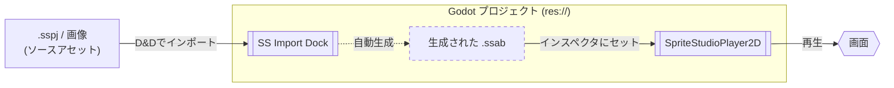

[**日本語**](./README.ja.md) | [**English**](./README.md)

# SpriteStudioPlayer for Godot

本developブランチは現在開発中のバージョンです。  
安定版は [mainブランチ](https://github.com/SpriteStudio/SSPlayerForGodot/tree/main) または、[Releases](https://github.com/SpriteStudio/SSPlayerForGodot/releases)から取得してください。  

> **注意:** 本書で扱う API・ワークフローは現在開発中のため、予告なく変更される可能性があります。また、本ブランチに関していかなる保証もサポートも提供せず、リクエストやバグ報告への返信もできません。v1.x からの移行手順は別途マイグレーションドキュメントを用意予定です。

[OPTPiX SpriteStudio 7](https://www.webtech.co.jp/spritestudio/) で作成したアニメーションを [Godot Engine](https://godotengine.org/) 上で再生するためのハイパフォーマンスなプラグインです。
このプラグインを使用することで、ラスターベースの2Dアニメーションを Godot プロジェクトへ簡単に実装・再生することができます。

## ドキュメント

詳細な使い方は `docs/` フォルダ内のドキュメントを参照してください。

- [**ドキュメント (日本語)**](./docs/ja/index.md)
- [**Documentation (English)**](./docs/en/index.md)

### クイックリンク (日本語)
- [インストール](./docs/ja/setup/install.md)
- [データのインポート](./docs/ja/workflow/import.md)
- [基本的な使い方](./docs/ja/workflow/usage.md)
- [応用的な使い方・Tips](./docs/ja/workflow/tips.md)
- [ビルドガイド](./docs/ja/setup/build.md)

## クイックスタート

1. **Godot Engine の準備**: [公式サイト](https://godotengine.org/download/) から 4.6 系のエディタをダウンロードします。
2. **GDExtension の取得**: [Releases](https://github.com/SpriteStudio/SSPlayerForGodot/releases) から最新パッケージをダウンロードします。
3. **配置**: `addons` フォルダを Godot プロジェクトのルートにコピーします。
4. **インポート**: `.sspj` を Godot エディタにドラッグ＆ドロップして `.ssab` へ変換します。
5. **再生**: `SpriteStudioPlayer2D` ノードを追加し、`SSAB Resource` プロパティに生成された `.ssab` を指定します。

詳細は [インストールガイド](./docs/ja/setup/install.md) を参照してください。

## 概要 (Overview)

SpriteStudio のソースアセットから Godot で再生されるまでのデータフローは以下の通りです。

1.  **ソースアセット**: SpriteStudio 7 で作成されたアニメーションは `.sspj`（プロジェクト）、`.ssae`（アニメ）、`.ssce`（セルマップ）および画像として構成されます。
2.  **変換 (Conversion)**: Godot での高速な再生を実現するため、専用の **SS Import Dock**（エディタ内蔵）または **ssconverter-cli** を使用して、最適化されたバイナリ形式（`.ssab` / `.ssqb`）に変換します。
3.  **Godot ランタイム**: 生成されたバイナリを `SSABResource` として読み込み、`SpriteStudioPlayer2D` ノードを通じて再生します。内部では `libssruntime` が高速なレンダリング処理を行います。

## サンプル

[examples フォルダ](./examples/) に SDK のテストプロジェクトに基づいたサンプルプロジェクトがあります。

- [allAttributeV7](./examples/allAttributeV7) — 全属性の機能テスト
- [allPartsV7](./examples/allPartsV7) — 全パーツ種の機能テスト
- [overall](./examples/overall) — 総合的な機能テスト
- [overall_gdextension](./examples/overall_gdextension) — GDExtension 版での総合テスト
- [ParticleEffect](./examples/ParticleEffect) — エフェクト機能のテスト
- [dev_module](./examples/dev_module) — モジュール版開発用プロジェクト
- [dev_gdextension](./examples/dev_gdextension) — GDExtension 版開発用プロジェクト

## 関連リポジトリ

- [SpriteStudio7-SDK](https://github.com/SpriteStudio/SpriteStudio7-SDK) — `libssruntime` / `libssconverter` を提供する SDK 本体

## ライセンス

[LICENSE.txt](./LICENSE.txt) を参照してください。
