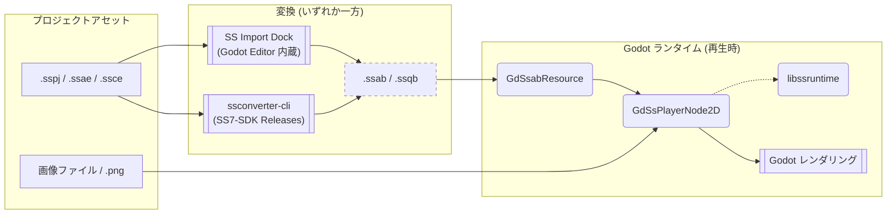

[**日本語**](./README.ja.md) | [**English**](./README.md)

# SpriteStudioPlayer for Godot

> **Note:** 本リポジトリは現在開発中のバージョンです。インターフェースは予告なく変更される可能性があります。
> v1.x からの移行手順は別途マイグレーションドキュメントを用意予定です。

[OPTPiX SpriteStudio](https://www.webtech.co.jp/spritestudio/) で作成したアニメーションを [Godot Engine](https://godotengine.org/) 上で再生するためのプラグインです。
実行時パフォーマンスを優先するため C++ モジュールの形態を取り、再生処理は [SpriteStudio7-SDK](https://github.com/SpriteStudio/SpriteStudio7-SDK) が提供する `libssruntime` を介して行います。

## 概要 (Overview)

本プラグインを利用してアニメーションを再生する際の流れを以下に示します。

> **図の凡例**
> - **図形**: `[ ]` データ/ファイル, `( )` ライブラリ/コンポーネント, `[[ ]]` ツール/アプリケーション
> - **矢印**: `-->` データの流れ, `-.->` 依存/参照
> - **枠線**: 点線枠は生成されたファイルを示します。



`.sspj` → `.ssab` / `.ssqb` への変換は2通りの方法があり、いずれの方法で生成したファイルも同じく `GdSsabResource` / `GdSsqbResource` として Godot から読み込めます。詳細は [USAGE.ja.md](./USAGE.ja.md) を参照してください。

- ノード
    - `GdSsPlayerNode2D`: SS アニメーションを再生する `Node2D` ベースのノード。
- リソース
    - `GdSsabResource`: 変換後のアニメバイナリ (`.ssab`) を表すリソース。
    - `GdSsqbResource`: 変換後のシーケンスバイナリ (`.ssqb`) を表すリソース。
- エディタ拡張
    - `SS Import Dock`: `.sspj` を `libssconverter` で `.ssab` / `.ssqb` へ変換するインポートコントロール。

## 対応バージョン

- **Godot Engine**: [4.6 ブランチ](https://github.com/godotengine/godot/tree/4.6)
- **godot-cpp**: [4.5 ブランチ](https://github.com/godotengine/godot-cpp/tree/4.5)

Windows / macOS でのビルドおよび実行を確認しています。

## クイックスタート

### 1. リポジトリの取得

```bash
git clone --recursive https://github.com/SpriteStudio/SSPlayerForGodot.git
cd SSPlayerForGodot
```

### 2. libssruntime の取得

[SpriteStudio7-SDK のリリースページ](https://github.com/SpriteStudio/SpriteStudio7-SDK/releases) から該当プラットフォームの SDK バイナリ一式を取得し、`gd_spritestudio/runtime/` 配下に展開します。詳細は [BUILD.ja.md](./BUILD.ja.md#1-libssruntime-の用意) を参照してください。

### 3. Godot 用バイナリのビルド

GDExtension を利用する場合・カスタムモジュール組み込み Godot を利用する場合のいずれかを選んでビルドします。
詳細は [BUILD.ja.md](./BUILD.ja.md) を参照してください。

### 4. 利用方法

`.sspj` のインポートからノードへの紐づけ、再生制御まで一通りの利用方法は [USAGE.ja.md](./USAGE.ja.md) を参照してください。

## サンプル

[examples フォルダ](./examples/)にサンプルプロジェクトがあります。

- [feature_test](./examples/feature_test) — カスタムモジュール版の基本機能テスト
- [feature_test_gdextension](./examples/feature_test_gdextension) — GDExtension 版の基本機能テスト
- [mesh_bone](./examples/mesh_bone) — メッシュ・ボーン・エフェクトを利用したキャラクターアニメ
- [particle_effect](./examples/particle_effect) — エフェクト機能のサンプル

## 関連リポジトリ

- [SpriteStudio7-SDK](https://github.com/SpriteStudio/SpriteStudio7-SDK) — `libssruntime` / `libssconverter` を提供する SDK 本体
