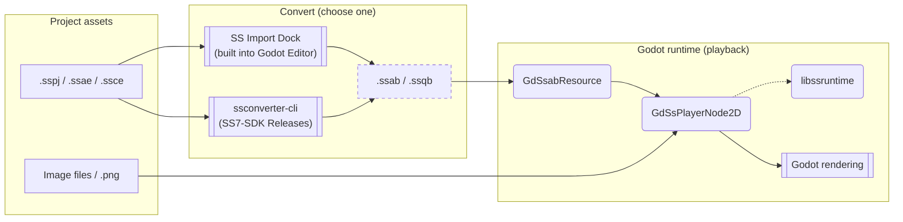

[**日本語**](./README.ja.md) | [**English**](./README.md)

# SpriteStudioPlayer for Godot

> **Note:** This repository is a work-in-progress version. Interfaces may change without notice.
> A migration guide for v1.x users will be provided as a separate document.

A plugin for playing back animations created with [OPTPiX SpriteStudio](https://www.webtech.co.jp/spritestudio/) inside [Godot Engine](https://godotengine.org/).
The plugin is implemented as a C++ module to prioritize runtime performance, and uses `libssruntime` provided by [SpriteStudio7-SDK](https://github.com/SpriteStudio/SpriteStudio7-SDK) for animation playback.

## Overview

The diagram below shows how data flows through the plugin from authored assets to in-game playback.

> **Diagram legend**
> - **Shapes**: `[ ]` data/files, `( )` libraries/components, `[[ ]]` tools/applications
> - **Arrows**: `-->` data flow, `-.->` dependency/reference
> - **Borders**: dashed borders indicate generated files.



There are two ways to convert `.sspj` to `.ssab` / `.ssqb`. Files produced by either method are loaded as `GdSsabResource` / `GdSsqbResource` in Godot. See [USAGE.md](./USAGE.md) for details.

- Nodes
    - `GdSsPlayerNode2D`: A `Node2D`-based node for playing back SS animations.
- Resources
    - `GdSsabResource`: Resource representing a converted animation binary (`.ssab`).
    - `GdSsqbResource`: Resource representing a converted sequence binary (`.ssqb`).
- Editor extension
    - `SS Import Dock`: An import control that converts `.sspj` to `.ssab` / `.ssqb` via `libssconverter`.

## Supported Versions

- **Godot Engine**: [4.6 branch](https://github.com/godotengine/godot/tree/4.6)
- **godot-cpp**: [4.5 branch](https://github.com/godotengine/godot-cpp/tree/4.5)

Build and execution have been verified on Windows / macOS.

## Quick Start

### 1. Clone the repository

```bash
git clone --recursive https://github.com/SpriteStudio/SSPlayerForGodot.git
cd SSPlayerForGodot
```

### 2. Obtain libssruntime

Download the SDK binaries for your target platform from the [SpriteStudio7-SDK Releases page](https://github.com/SpriteStudio/SpriteStudio7-SDK/releases) and extract them under `gd_spritestudio/runtime/`. See [BUILD.md](./BUILD.md#1-prepare-libssruntime) for details.

### 3. Build the Godot binaries

Choose either GDExtension or a custom-module Godot Engine build, and run the corresponding script.
See [BUILD.md](./BUILD.md) for details.

### 4. Use the plugin

Importing `.sspj`, attaching resources to nodes, and controlling playback are covered in [USAGE.md](./USAGE.md).

## Samples

Sample projects are available under the [examples folder](./examples/).

- [feature_test](./examples/feature_test) — Basic functional test (custom-module build)
- [feature_test_gdextension](./examples/feature_test_gdextension) — Basic functional test (GDExtension build)
- [mesh_bone](./examples/mesh_bone) — Character animation using mesh, bone, and effect features
- [particle_effect](./examples/particle_effect) — Effect feature sample

## Related Repositories

- [SpriteStudio7-SDK](https://github.com/SpriteStudio/SpriteStudio7-SDK) — The SDK itself, providing `libssruntime` / `libssconverter`
