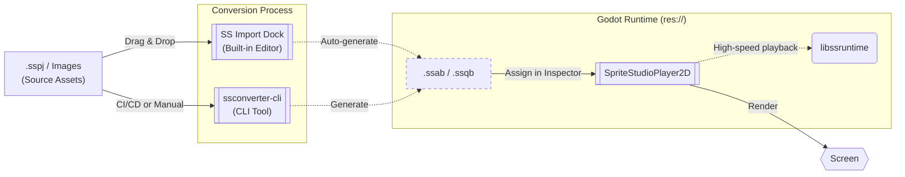

[**日本語**](./README.ja.md) | [**English**](./README.md)

# SpriteStudioPlayer for Godot

This `develop` branch is a work-in-progress version.  
The stable version can be obtained from the [main branch](https://github.com/SpriteStudio/SSPlayerForGodot/tree/main) or from [Releases](https://github.com/SpriteStudio/SSPlayerForGodot/releases).  

> **Note:** The APIs and workflows described here are still under active development and may change without notice. No warranty or support is provided for this branch, and we cannot respond to feature requests or bug reports.

A high-performance plugin for playing back animations created with [OPTPiX SpriteStudio 7](https://www.webtech.co.jp/spritestudio/) inside [Godot Engine](https://godotengine.org/).
This plugin allows you to easily implement and play back raster-based 2D animations within your Godot projects.

## Documentation

Comprehensive documentation is available in the `docs/` folder:

- [**Documentation (English)**](./docs/en/index.md)
- [**ドキュメント (日本語)**](./docs/ja/index.md)

### Quick Links (English)
- [Installation](./docs/en/setup/install.md)
- [Basic Usage](./docs/en/workflow/usage_basic.md)
- [Editor Integration and Asset Iteration](./docs/en/workflow/usage_asset_pipeline.md)
- [Scripting and Events](./docs/en/workflow/usage_scripting.md)
- [CLI Conversion and Automation](./docs/en/workflow/import.md)
- [Performance and Advanced Settings](./docs/en/workflow/tips.md)
- [Build Guide](./docs/en/setup/build.md)
- [Migration from v1.x](./docs/en/migration_from_v1.md)

## Quick Start with GDExtension

We provide two Quick Starts: one for quickly checking the operation using a sample project, and another for setting up your own project.

### 1. Check Operation with Sample

1. **Get Godot Engine**: Download a 4.6-series editor from the [official site](https://godotengine.org/download/).
2. **Download GDExtension**: Get the latest package from [Releases](https://github.com/SpriteStudio/SSPlayerForGodot/releases) and extract it.
3. **Prepare Sample**: Copy the extracted `addons` folder into the `[examples/Ringo](./examples/Ringo)` folder of this repository.
4. **Check**: Open the `[examples/Ringo](./examples/Ringo)` project in Godot Engine and open `Ringo.tscn` to immediately see the animation working.

### 2. Introduce to Your Project

1. **Install**: Copy the `addons` folder into your Godot project root.
2. **Import**: Drag & drop your `.sspj` onto the Godot editor to convert it to `.ssab`.
3. **Play**: Add a `SpriteStudioPlayer2D` node and assign the `.ssab` to its `SSAB Resource` property.

For more details, see the [Installation Guide](./docs/en/setup/install.md).

## Overview

This plugin features a **powerful asset pipeline that allows you to seamlessly transition between SpriteStudio and Godot**, enabling you to update assets instantly. For details, please refer to [Editor Integration and Asset Iteration](./docs/en/workflow/usage_asset_pipeline.md).

The following diagram shows the basic data flow from SpriteStudio source assets to Godot runtime.

1.  **Source Assets**: Animations are authored in SpriteStudio 7, producing `.sspj` (Project), `.ssae` (Animation), and `.ssce` (CellMap) files along with textures.
2.  **Conversion**: To ensure high performance in Godot, source assets are converted into optimized binary formats (`.ssab` / `.ssqb`) using the **SS Import Dock** (built-in) or **ssconverter-cli**.
3.  **Godot Runtime**: The generated binaries are loaded as `SSABResource` and played back via the `SpriteStudioPlayer2D` node, which utilizes `libssruntime` for efficient rendering.

## Samples

Sample projects based on SDK test projects are available under the [examples folder](./examples/).

- [Ringo](./examples/Ringo) — Test for Ringo
- [allAttributeV7](./examples/allAttributeV7) — Functional test for all attributes
- [allPartsV7](./examples/allPartsV7) — Functional test for all part types
- [overall](./examples/overall) — Comprehensive functional test
- [overall_gdextension](./examples/overall_gdextension) — Comprehensive test for GDExtension
- [ParticleEffect](./examples/ParticleEffect) — Test for effect features

## Related Repositories

- [SpriteStudio7-SDK](https://github.com/SpriteStudio/SpriteStudio7-SDK) — The SDK itself, providing `libssruntime` / `libssconverter`

## License

See [LICENSE.txt](./LICENSE.txt).
