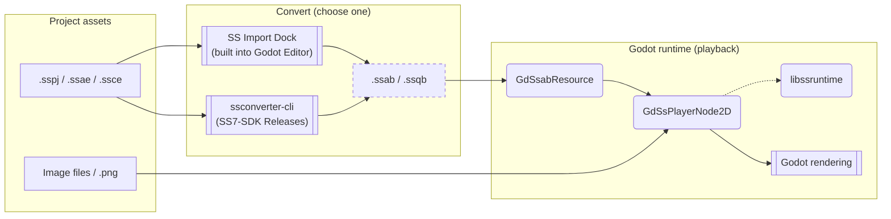

[**日本語**](./README.ja.md) | [**English**](./README.md)

# SpriteStudioPlayer for Godot

This repository is a work-in-progress version.
No warranty or support is provided for this repository, and we cannot respond to feature requests or bug reports.
Interfaces may change without notice. A migration guide for v1.x users will be provided as a separate document.

A plugin for playing back animations created with [OPTPiX SpriteStudio](https://www.webtech.co.jp/spritestudio/) inside [Godot Engine](https://godotengine.org/).
Animation playback uses `libssruntime` provided by [SpriteStudio7-SDK](https://github.com/SpriteStudio/SpriteStudio7-SDK).

## Overview

The diagram below shows how data flows through the plugin from authored assets to in-game playback.

> **Diagram legend**
> - **Shapes**: `[ ]` data/files, `( )` libraries/components, `[[ ]]` tools/applications
> - **Arrows**: `-->` data flow, `-.->` dependency/reference
> - **Borders**: dashed borders indicate generated files.

There are two ways to convert `.sspj` to `.ssab` / `.ssqb`. Files produced by either method are loaded as `GdSsabResource` / `GdSsqbResource` in Godot. See [USAGE.md](./USAGE.md) for details.

- Nodes
    - `GdSsPlayerNode2D`: A `Node2D`-based node for playing back SS animations.
- Resources
    - `GdSsabResource`: Resource representing a converted animation binary (`.ssab`).
    - `GdSsqbResource`: Resource representing a converted sequence binary (`.ssqb`).
- Editor extension
    - `SS Import Dock`: An import control that converts `.sspj` to `.ssab` / `.ssqb` via `libssconverter`.

## Supported Versions

- **Godot Engine**: [4.6 branch](https://github.com/godotengine/godot/tree/4.6)
- **godot-cpp**: [4.5 branch](https://github.com/godotengine/godot-cpp/tree/4.5)

Build and execution have been verified on Windows / macOS.

## Quick Start

The shortest path: download a prebuilt GDExtension and use it without any local build.

### 1. Install Godot Engine

Download a 4.6-series editor from the [official site](https://godotengine.org/download/).

### 2. Get the SSPlayerForGodot GDExtension

Download the GDExtension package for your target platform from the [SSPlayerForGodot Releases page](https://github.com/SpriteStudio/SSPlayerForGodot/releases).

### 3. Drop it into your project

Extract the downloaded GDExtension files into your Godot project according to the paths declared in the `.gdextension` file (the sample projects in this repository use `bin/`).
After restarting the Godot editor, the `GdSsPlayerNode2D` node and the SS Import Dock become available.

### 4. Convert and play SpriteStudio data

For converting `.sspj` and playing it back via `GdSsPlayerNode2D`, see [USAGE.md](./USAGE.md#importing-spritestudio-data).

## Samples

Sample projects are available under the [examples folder](./examples/).

> **Note:** Existing samples were created for the v1.x `.sspj` direct-load workflow and need to be migrated to the current `.ssab` / `.ssqb` workflow before they will run on this branch. They will be updated alongside the migration guide.

- [feature_test](./examples/feature_test) — Basic functional test (custom-module build)
- [feature_test_gdextension](./examples/feature_test_gdextension) — Basic functional test (GDExtension build)
- [mesh_bone](./examples/mesh_bone) — Character animation using mesh, bone, and effect features
- [particle_effect](./examples/particle_effect) — Effect feature sample

## Building / Developing

If you want to build the GDExtension or a custom-module Godot Engine yourself, or to develop the plugin in parallel with SS7-SDK, see [BUILD.md](./BUILD.md).

## Related Repositories

- [SpriteStudio7-SDK](https://github.com/SpriteStudio/SpriteStudio7-SDK) — The SDK itself, providing `libssruntime` / `libssconverter`

## License

See [LICENSE.txt](./LICENSE.txt).
