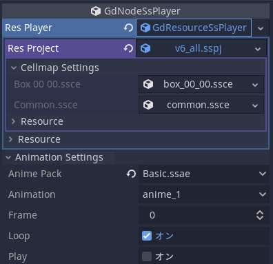

# エディタの選択
下記どちらかの方法で利用してください。

## SpriteStudioPlayer のカスタムモジュールを組み込んだ Godot Engine を利用する
[BUILD.md](BUILD.md) を参照して SpriteStudioPlayer のカスタムモジュールを組み込んだ Godot をビルドしてください。

## SpriteStudioPlayer の GDExtension ファイルを利用する
1. 本家サイト(https://godotengine.org/download/) より、該当するバージョンの Godot ダウンロードします。
2. SpriteStudioPlayer の GDExtension ファイルを用意します。
    - [リリース](https://github.com/SpriteStudio/SSPlayerForGodot/releases) に GDExtension ファイルの成果物を用意しているので、そちらを利用してください。
    - GDExtension を自前でビルドする場合は [BUILD.md](BUILD.md) を参照してください
3. SpriteStudioPlayer の GDExtension ファイルをプロジェクトディレクトリの `bin` ディレクトリへ格納します。


# SpriteStudioデータのインポート

SpriteStudioデータのインポート手順について説明します。  
現在の SpriteStudio for Godot プラグインでは sspj ファイルを直接指定する形態になっています。  
ご利用のプロジェクト下のフォルダに sspj、ssae、ssce と画像ファイルなどの一式を配置します。  

# SpriteStudioノードの作成と sspj ファイルの指定

1. 「Node を新規作成」から「GdNodeSsPlayer」を選択し、「作成」ボタンを押します。
2. インスペクターの「Res Player」から「新規 GdResourceSsPlayer」を選択します。
3. GdResourceSsPlayer の「Res Project」から「読み込み」を選択します。
4. 「ファイルを開く」ダイアログから「*.sspj」ファイルを選択して開きます。

# アニメーションの指定

1. 「Animation Settings」を展開「Anime Pack」から再生させる「*.ssae」ファイルを選択します。
2. 続いて「Animation」から再生させるアニメーションを選択します。
3. Frame をドラッグしたり、Play フラグをオンにすることでプレビューできます。

## インスペクターの各プロパティの意味



```
GdNodeSsPlayer               - SsPlayer を扱うノード
├── Res Player               - SsPlayer が使用するリソース
│   └── Res Project          - sspj ファイル
│      └── CellMap Settings  - セルマップの設定
│         ├── ssce File 01   - セルマップ
│         └── ssce File 02   - セルマップ
│
└── Animation Settings       - アニメーションの設定
    ├── Anime Pack           - アニメパック
    ├── Animation            - アニメーション
    ├── Frame                - 現在のフレーム
    ├── Loop                 - ループ再生フラグ
    ├── Playing              - 再生フラグ
    └── Texture Interpolate  - テクスチャ補間フラグ
```

## テクスチャ補間フラグについて

SSPlayer for Godot の実装(v1.2.0時点)では、一度アニメーションをテクスチャにレンダリングした後、Godot のレンダラーによってスクリーンバッファに描画されます。  
このテクスチャにレンダリングする際にバイリニア補間をかける場合はフラグをオンに設定します。  
この状態では回転して斜めになったパーツのエッジにアンチエイリアスがかかりますが、この動作が好ましくない場合はオフにしてください。  
このフラグをオフに設定し、CanvasItem の Texture の FilterMode も Nearest にしておくとスクリーンバッファに描画する際にも補間がかからずピクセルのエッジが明確になります。  
例えばピクセルアート系のゲームで利用する場合は、この設定を試してみて下さい。  

### レンダリングするテクスチャのサイズ
レンダリングするテクスチャのサイズはSpriteStudio上でアニメーションに設定した「基準枠」のサイズが採用されます。(v1.2.0時点)

# クラス

GDScript からコントロールできるクラスの役割と主要なメソッドについて説明します。  
各クラスが持っている全てのメソッド、プロパティ、シグナルについては Godot の Script 画面で確認してみてください。  

## リソース管理クラス

SpriteStudio の各種 .ss** ファイルに相当するリソースを管理するクラスがあります。

### [GdResourceSsProject](./gd_spritestudio/gd_resource_ssproject.h) クラス

１つの sspj ファイルに相当するリソースを取り扱うクラスです。
sspj に登録された ssae, ssce, ssee 各々のリソースの取得と設定を行います。

### [GdResourceSsCellMap](./gd_spritestudio/gd_resource_sscellmap.h) クラス

１つの ssce ファイルに相当するリソースを取り扱うクラスです。
現在テクスチャの取得と設定を行うメンバーのみ対応しています。

### [GdResourceSsAnimePack](./gd_spritestudio/gd_resource_ssanimepack.h) クラス

１つの ssae ファイルに相当するリソースを取り扱うクラスです。
内包しているアニメーションの数、とアニメーション名の取得を行えます。

### [GdResourceSsPlayer](./gd_spritestudio/gd_resource_ssplayer.h) クラス

現在 GdResourceSsProject リソースを設定、取得するアクセサのみです。

## 再生のためのクラス

GdNodeSsPlayer に前述のリソースを指定することで再生を行います。  
以下はファイルの読み込みから再生開始までのシンプルなサンプルコードです。  

```python
# GdNodeSsPlayerノードを指します。
## Godot 4
@onread var ssnode = $target
## Godot 3.x
# onready var ssnode = $target

func _ready():
  # sspj ファイルを読み込みます。
  ssnode.res_player.res_project = ResourceLoader.load("Sample.sspj")

  # ssaeファイルとアニメーションを指定します。
  ssnode.set_anime_pack("Sample.ssae")
  ssnode.set_animation("anime_1")
    
  # アニメーション終了時コールバックの設定
  ## Godot 4
  ssnode.connect("animation_finished", Callable(self, "_on_animation_finished"))
  ## Godot 3.x
  # ssnode.connect("animation_finished", self, "_on_animation_finished")

  # ループを指定して再生を開始します。
  ssnode.set_loop(true)
  ssnode.play()

# アニメ終了時のコールバック関数です
func _on_animation_finished(name):
	print("SIGNAL _on_animation_finished from " + name)
```

他にもカレントフレームの指定、一時停止、開始、終了フレーム、FPSの取得など一般的なメソッドがあります。  
一覧は Godot の Script 画面で確認してみてください。  

### シグナル

GdNodeSsPlayer が発行するシグナルについて説明します。

### on_animation_changed(name: String)

アニメーション変更時に発行されます。  
name：変更したアニメーション名

### on_animation_finished(name: String)

再生中のアニメーションが終了フレームに到達した時に発行されます。  
ループ再生オンでも毎周発行されます。  
name：変更したアニメーション名

### on_animepack_changed(name: String)

アニメパック変更時に発行されます。  
name：変更したアニメパック名  

### on_frame_changed(frame: int)

フレーム位置変更時に発行されます。  
frame：変更したフレーム位置  

### on_signal(command: String, value: Dictionary)

SpriteStudioのシグナルアトリビュートのキーフレーム到達時に発行されます。  
command：コマンド名  
value：パラメータ名と値のコレクション  

### on_user_data(flag: int, intValue: int, rectValue: Rect2, pointValue: Vector2, stringValue: String)

ユーザーデータのキーフレーム到達時に発行されます。

- flag：後続の引数が有効かどうかの論理値
   - 1：整数が有効
   - 2：範囲が有効
   - 4：位置が有効
   - 8：文字列が有効
- intValue：整数
- rectValue：範囲
- pointValue：位置
- stringValue：文字列

# 制限事項

## 動作しないもの

- マスク機能
- 描画モード：ミックス以外もミックス相当になります。
- SpriteStudio Ver.7.1 で追加された新機能(テキスト・サウンド・9スライス・シェイプ)

## 表示が異なるもの

- パーツカラー
  - [x] v1.1.1 で修正済：ミックスの頂点単位の時にX状(三角形の辺部分)の輝度が高くなっています。
  - [x] v1.1 で修正済：乗算でテクスチャカラーの割合がエディタより大きくなります。

## その他の制限

- インスタンスの独立動作がOnのパーツの再生について
  - シーン上で Frame プロパティが 0 以外の状態で Play プロパティを On にして再生開始した場合、独立動作がOnに設定されたインスタンスパーツを再生させた場合、インスタンスパーツの再生フレームがずれることがあります。
  - この場合、一旦 Frame プロパティの値を 0 以外に変更後、0 に戻してから再生開始することで一致させられます。
- シェーダー
  - SpriteStudio公式の一部のみ対応しています。
  - カスタムシェーダーは独自に追加・対応する必要があります。
