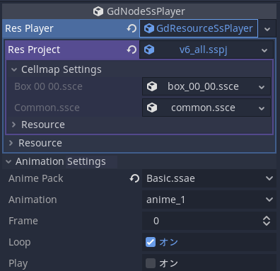

[**日本語**](./USAGE.ja.md) | [**English**](./USAGE.md)

# Choosing the Editor

Use one of the following methods:

## Using Godot Engine with the SpriteStudioPlayer Custom Module

Build Godot with the SpriteStudioPlayer custom module included.  
See [BUILD.md](BUILD.md) for instructions.

## Using the SpriteStudioPlayer GDExtension Files

1. Download the appropriate version of Godot from the official website:  
   https://godotengine.org/download/
2. Prepare the SpriteStudioPlayer GDExtension files:  
   - Prebuilt binaries are available under [Releases](https://github.com/SpriteStudio/SSPlayerForGodot/releases).  
   - To build the GDExtension yourself, see [BUILD.md](BUILD.md).
3. Place the SpriteStudioPlayer GDExtension files into your project’s `bin` directory.

# Importing SpriteStudio Data

This section explains how to import SpriteStudio data.  
With the current SpriteStudio for Godot plugin, `.sspj` files are specified directly.  
Place the `.sspj`, `.ssae`, `.ssce`, and related image files in a folder under your project.

# Creating a SpriteStudio Node and Specifying the SSPJ File

1. Create a new node and select **GdNodeSsPlayer**, then click **Create**.  
2. In the Inspector, select **New GdResourceSsPlayer** under **Res Player**.  
3. Under **Res Project**, select **Load**.  
4. Choose the `*.sspj` file from the file dialog.

# Selecting an Animation

1. Expand **Animation Settings**, then select the `*.ssae` file you want to play from **Anime Pack**.  
2. Next, choose the animation you want to play under **Animation**.  
3. You can preview the animation by dragging the **Frame** slider or enabling the **Play** flag.

## Meaning of Inspector Properties



```
GdNodeSsPlayer               - Node that handles the SsPlayer
├── Res Player               - Resource used by the SsPlayer
│   └── Res Project          - SSPJ file
│      └── CellMap Settings  - Cellmap settings
│         ├── ssce File 01   - Cellmap
│         └── ssce File 02   - Cellmap
│
└── Animation Settings       - Animation settings
    ├── Anime Pack           - Animation pack
    ├── Animation            - Animation
    ├── Frame                - Current frame
    ├── Loop                 - Loop playback flag
    ├── Playing              - Playback flag
    └── Texture Interpolate  - Texture interpolation flag
```

## About the Texture Interpolation Flag

In the current implementation of SSPlayer for Godot (as of v1.2.0), the animation is first rendered into a texture and then drawn to the screen buffer by Godot’s renderer.  
Enable this flag if you want bilinear interpolation applied when rendering to the texture.  
When enabled, anti-aliasing is applied to the edges of parts that have been rotated or angled. If this is undesirable, disable the flag.  
If you turn this flag off and also set the CanvasItem’s **Texture → FilterMode** to **Nearest**, interpolation will not be applied when drawing to the screen buffer, resulting in crisp pixel edges.  
This is especially useful for pixel‑art style games, so consider trying this configuration.

### Texture Size Used for Rendering

The texture size used during rendering is based on the **“Base Frame”** size configured for the animation in SpriteStudio. (As of v1.2.0)

# Classes

This section describes the roles and primary methods of the classes that can be controlled via GDScript.  
For the full list of methods, properties, and signals for each class, refer to the Script view in Godot.

## Resource Management Classes

These classes correspond to the various `.ss**` files of SpriteStudio.

### [GdResourceSsProject](./gd_spritestudio/gd_resource_ssproject.h)

Manages a single `sspj` file.  
Handles retrieving and setting the resources registered in the sspj: `ssae`, `ssce`, and `ssee`.

### [GdResourceSsCellMap](./gd_spritestudio/gd_resource_sscellmap.h)

Manages a single `ssce` file.  
Currently supports only retrieving and setting the texture.

### [GdResourceSsAnimePack](./gd_spritestudio/gd_resource_ssanimepack.h)

Manages a single `ssae` file.  
Allows retrieving the number of animations and the animation names.

### [GdResourceSsPlayer](./gd_spritestudio/gd_resource_ssplayer.h)

Provides accessors for setting and retrieving the current `GdResourceSsProject`.

## Classes for Playback

Assign the described resources to `GdNodeSsPlayer` to play animations.  
Below is a simple example showing file loading and playback:

```python
# Reference to the GdNodeSsPlayer node.
## Godot 4
@onready var ssnode = $target
## Godot 3.x
# onready var ssnode = $target

func _ready():
    # Load the sspj file.
    ssnode.res_player.res_project = ResourceLoader.load("Sample.sspj")

    # Specify the ssae file and animation.
    ssnode.set_anime_pack("Sample.ssae")
    ssnode.set_animation("anime_1")

    # Set the callback for animation completion.
    ## Godot 4
    ssnode.connect("animation_finished", Callable(self, "_on_animation_finished"))
    ## Godot 3.x
    # ssnode.connect("animation_finished", self, "_on_animation_finished")

    # Enable looping and start playback.
    ssnode.set_loop(true)
    ssnode.play()

# Callback function for when the animation finishes.
func _on_animation_finished(name):
    print("SIGNAL _on_animation_finished from " + name)
```

Other standard methods include selecting the current frame, pausing, playing, setting the end frame, retrieving FPS, and more.  
The full list can be checked in Godot's Script view.

### Signals

The signals emitted by `GdNodeSsPlayer` are described below.

### on_animation_changed(name: String)

Emitted when the animation changes.  
`name`: Name of the new animation

### on_animation_finished(name: String)

Emitted when the animation reaches its final frame.  
This is emitted each loop when looping is enabled.  
`name`: Name of the animation that finished

### on_animepack_changed(name: String)

Emitted when the anime pack changes.  
`name`: Name of the new anime pack

### on_frame_changed(frame: int)

Emitted when the frame position changes.  
`frame`: Updated frame index

### on_signal(command: String, value: Dictionary)

Emitted when reaching a keyframe containing a SpriteStudio signal attribute.  
`command`: Command name  
`value`: Dictionary of parameter names and values

### on_user_data(flag: int, intValue: int, rectValue: Rect2, pointValue: Vector2, stringValue: String)

Emitted when reaching a keyframe with user data.

- `flag`: Bitmask indicating which values are valid  
  - `1`: Integer is valid  
  - `2`: Rect is valid  
  - `4`: Position is valid  
  - `8`: String is valid  
- `intValue`: Integer  
- `rectValue`: Rect  
- `pointValue`: Position  
- `stringValue`: String

# Limitations

## Not Supported

- Mask functionality  
- Drawing modes: all modes behave like Mix  
- New features added in SpriteStudio Ver. 7.1  
  (Text, Sound, 9‑slice, Shape)

## Differences in Display

- Parts Color  
  - [x] Fixed in v1.1.1: Brightness of X‑shaped (triangle edge) portions was too high when using vertex‑level Mix mode  
  - [x] Fixed in v1.1: Texture color ratio differed from the editor when using Multiply mode

## Other Limitations

- Independent Instance Behavior  
  - If **Frame** is set to a non‑zero value when **Play** is turned on, and an instance part with independent playback is used, the instance animation may become misaligned.  
  - Workaround: Change **Frame** to a non‑zero value, then change it back to 0 before starting playback.

- Shaders  
  - Only some of the official SpriteStudio shaders are supported.  
  - Custom shaders must be implemented manually.
