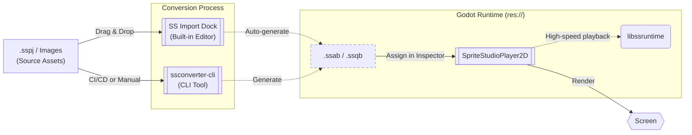

# SpriteStudioPlayer for Godot

This `develop` branch is a work-in-progress version.  
The stable version can be obtained from the [main branch](https://github.com/SpriteStudio/SSPlayerForGodot/tree/main) or from [Releases](https://github.com/SpriteStudio/SSPlayerForGodot/releases).  
No warranty or support is provided for this branch, and we cannot respond to feature requests or bug reports.  
Interfaces may change without notice. A migration guide for v1.x users will be provided as a separate document.  

A plugin for playing back animations created with [OPTPiX SpriteStudio](https://www.webtech.co.jp/spritestudio/) inside [Godot Engine](https://godotengine.org/).
Animation playback uses `libssruntime` provided by [SpriteStudio7-SDK](https://github.com/SpriteStudio/SpriteStudio7-SDK).

## Key Features

This plugin is designed to bring the full expressive power of SpriteStudio 7 to Godot Engine seamlessly.

*   **Full Feature Support:** Fully supports SpriteStudio 7 features including bone hierarchies, mesh & deformations, and high-performance particle effects.
*   **Seamless Integration and a Powerful Asset Pipeline:** In addition to easy drag-and-drop importing via the built-in "SS Import Dock", you can open SpriteStudio directly from the Inspector and reconvert with a single click, providing a **powerful asset pipeline that allows you to seamlessly transition between SpriteStudio and Godot**. For details, see [Editor Integration and Asset Iteration](workflow/usage_asset_pipeline.md).
*   **Dynamic Customization (CellMap Overrides):** Easily swap textures at runtime to implement character equipment changes or color variations.
*   **Signals & Events:** Receive "User Data" and "Signals" from your animation timeline directly as Godot Signals, allowing frame-perfect triggers for audio or logic.
*   **Smooth Slow-Motion:** Built-in sub-frame interpolation ensures buttery-smooth playback even on high-refresh-rate displays or during slow-motion effects.
*   **High Performance & Low Memory:** Backed by `libssruntime`'s SIMD optimizations and zero-parse overhead binary formats (`.ssab`), it renders massive amounts of characters efficiently, even on mobile targets.

## Overview

The diagram below shows how data flows through the plugin from authored assets to in-game playback.

## Supported Versions

- **Godot Engine**: [4.6 branch](https://github.com/godotengine/godot/tree/4.6)
- **godot-cpp**: [master branch](https://github.com/godotengine/godot-cpp/tree/master)

> [!NOTE]
> GDExtension is officially supported starting from Godot 4.6.

Build and execution have been verified on Windows / macOS.

## Samples

Sample projects based on SDK test projects are available under the `examples/` folder in the repository.

- [allAttributeV7](../../examples/allAttributeV7) — Functional test for all attributes
- [allPartsV7](../../examples/allPartsV7) — Functional test for all part types
- [overall](../../examples/overall) — Comprehensive functional test
- [overall_gdextension](../../examples/overall_gdextension) — Comprehensive test for GDExtension
- [ParticleEffect](../../examples/ParticleEffect) — Test for effect features
- [Ringo](../../examples/Ringo) — Test for Ringo

## Related Repositories

- [SpriteStudio7-SDK](https://github.com/SpriteStudio/SpriteStudio7-SDK) — The SDK itself, providing `libssruntime` / `libssconverter`

## License

See [LICENSE.txt](../../LICENSE.txt).
