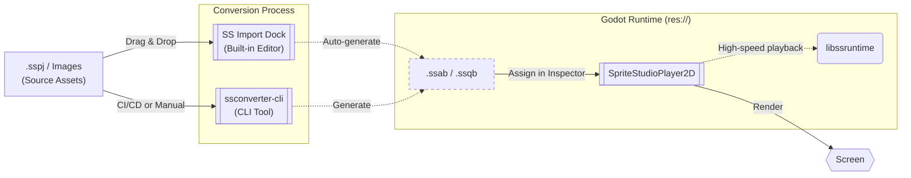

# 🕹️ SpriteStudioPlayer for Godot

This `develop` branch is a work-in-progress version.  
The stable version can be obtained from the [main branch](https://github.com/cri-middleware/SSPlayerForGodot/tree/main) or from [Releases](https://github.com/cri-middleware/SSPlayerForGodot/releases).  
No warranty or support is provided for this branch, and we cannot respond to feature requests or bug reports.  
Interfaces may change without notice.  

A plugin for playing back animations created with [OPTPiX SpriteStudio](https://www.webtech.co.jp/spritestudio/) inside [Godot Engine](https://godotengine.org/).
Animation playback uses `libssruntime` provided by [SpriteStudio-SDK](https://github.com/cri-middleware/SpriteStudio-SDK).

## Table of Contents

- **Setup**
    - [Installation](setup/install.md)
    - [Build Guide](setup/build.md)
- **Workflow**
    - [Basic Usage](workflow/usage_basic.md)
    - [Integration with AnimationPlayer](workflow/animation_player.md)
    - [Asset Import and Editor Integration](workflow/usage_asset_pipeline.md) (start here for the initial `.sspj` import)
    - [Scripting and Events](workflow/usage_scripting.md)
    - [Audio Playback](workflow/audio.md)
    - [Exporting Your Project](workflow/export.md)
- **Advanced Topics**
    - [CLI Conversion and Automation](workflow/import.md)
    - [Performance Tuning and Advanced Settings](workflow/tips.md)
- **API Reference**
    - [SpriteStudioPlayer2D](api/player.md)
    - [Resource Classes](api/resource.md)
- [Troubleshooting](troubleshooting.md)
- [Limitations & Scope](limitations.md)
- [Migration from v1.x](migration_from_v1.md)
- **License**
    - [License](license.md)
    - [Third-Party Notices](third_party_notices.md)

## Key Features

This plugin is designed to bring the full expressive power of SpriteStudio 7 to Godot Engine seamlessly.

*   **Full Feature Support:** Fully supports SpriteStudio 7 features including bone hierarchies, mesh & deformations, and high-performance particle effects.
*   **Seamless Integration and a Powerful Asset Pipeline:** In addition to easy drag-and-drop importing via the built-in "SS Import Dock", you can open SpriteStudio directly from the Inspector and reconvert with a single click, providing a **powerful asset pipeline that allows you to seamlessly transition between SpriteStudio and Godot**. For details, see [Asset Import and Editor Integration](workflow/usage_asset_pipeline.md).
*   **Dynamic Customization (CellMap Overrides):** Easily swap textures at runtime to implement character equipment changes or color variations.
*   **Signals & Events:** Receive "User Data" and "Signals" from your animation timeline directly as Godot Signals, allowing frame-perfect triggers for game logic. Every event says which part fired it.
*   **Audio That Just Plays:** Audio parts sound through Godot with no setup — in the editor preview too. Adjust the volume, take it over through the `audio` signal, or route every sound to your own audio middleware with a [backend resource](workflow/audio.md).
*   **Per-Part Effects:** The thirteen SpriteStudio add-on shaders (sepia, outline, HSB, blur, pixelate, wave, noise and more) are reproduced natively — assigned in SpriteStudio, nothing to wire up in Godot.
*   **Smooth Slow-Motion:** Built-in sub-frame interpolation ensures buttery-smooth playback even on high-refresh-rate displays or during slow-motion effects.
*   **High Performance & Low Memory:** Backed by `libssruntime`'s SIMD optimizations and zero-parse overhead binary formats (`.ssab`), it renders massive amounts of characters efficiently, even on mobile targets.

## Overview

The diagram below shows how data flows through the plugin from authored assets to in-game playback.

## Supported Versions

- **Godot Engine**: [4.7 branch](https://github.com/godotengine/godot/tree/4.7)
- **godot-cpp**: [master branch](https://github.com/godotengine/godot-cpp/tree/master)

> [!NOTE]
> GDExtension is officially supported starting from Godot 4.7.

Build and execution have been verified on Windows / macOS.

## Samples

Sample projects based on SDK test projects are available under the `examples/` folder in the repository.

- [Ringo](https://github.com/cri-middleware/SSPlayerForGodot/tree/main/examples/Ringo) — Basic quickstart test for Ringo
- [Scripting](https://github.com/cri-middleware/SSPlayerForGodot/tree/main/examples/Scripting) — GDScript example for controlling animations and signals
- [Override_Ringo](https://github.com/cri-middleware/SSPlayerForGodot/tree/main/examples/Override_Ringo) — Attribute/material override example
- [overall](https://github.com/cri-middleware/SSPlayerForGodot/tree/main/examples/overall) — Comprehensive functional test (Custom Module)
- [overall_gdextension](https://github.com/cri-middleware/SSPlayerForGodot/tree/main/examples/overall_gdextension) — Comprehensive functional test (GDExtension)

## Related Repositories

- [SpriteStudio Docs](https://cri-middleware.github.io/SpriteStudio-Docs/) — the documentation portal for the SDK and its official players.
- [SpriteStudio-SDK](https://github.com/cri-middleware/SpriteStudio-SDK) — the SDK itself, providing `libssruntime` / `libssconverter`.
- [SSConverterGUI](https://github.com/cri-middleware/SSConverterGUI) — a standalone desktop GUI for converting `.sspj` without a player.

## Migration

For instructions on migrating from versions prior to v1.x, please refer to the [Migration Guide](migration_from_v1.md).

## License

See [License](license.md).

For third-party library licenses (such as FlatBuffers and SpriteStudio-SDK dependencies), see [Third-Party Notices](third_party_notices.md).

