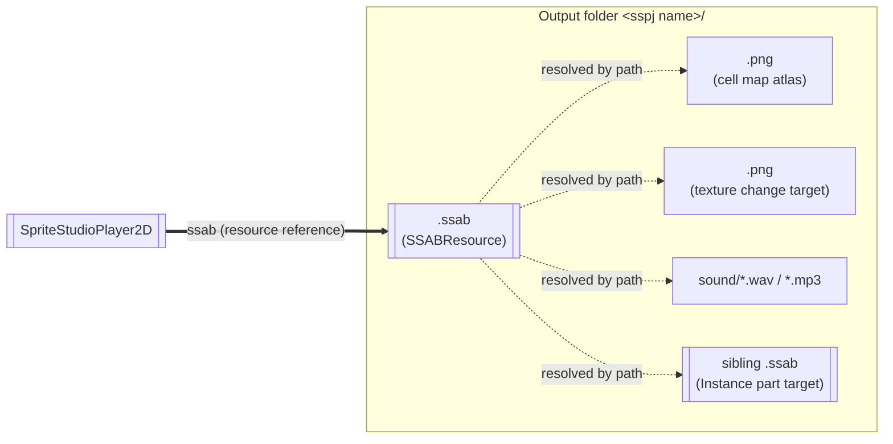

# 📦 Generated Assets, Exporting and Downloadable Packs

[← Back to documentation index](../index.md)

Converting a `.sspj` produces several files in the output folder. This page covers what you need in order to decide **how much of that has to travel together** when you export or ship a `.pck`: how the files depend on each other, **why the Godot editor cannot see those dependencies**, and what a reconvert overwrites and what it leaves alone.

For the import procedure itself see [Asset Import and Editor Integration](usage_asset_pipeline.md); for per-target export settings see [Exporting Your Project](export.md).

---

## How the SpriteStudio files map to the output

If you are handed a `.sspj` and asked to take it from there in Godot, the first thing to know is **which SpriteStudio file becomes which converted file**. The roles of `.sspj` / `.ssae` / `.ssce` / `.ssqe` and how they map are the same for every Player, so they are documented in the portal.

> [!NOTE]
> [SpriteStudio Docs: Asset Conversion — How a project's files map to the output](https://cri-middleware.github.io/SpriteStudio-Docs/overview/conversion/#how-a-projects-files-map-to-the-output)
>
> Two points matter here: **one `.ssae` becomes one `.ssab`**, and **cell positions are baked from the `.ssce` into the `.ssab`**. The latter decides whether you can swap the image on its own, below.

### What you did in SpriteStudio, and what that updates

| What you did in SpriteStudio | Output that changes | When shipping |
|---|---|---|
| Repainted the artwork only (cells untouched) | The `.png` alone | Shipping the pack that holds the images is enough |
| Added, moved or resized cells, or changed the image size (the `.ssce` changed) | The `.png` **and** the `.ssab` | **Ship both together.** Shipping one alone makes the artwork shift |
| Edited an animation (`.ssae`) | The corresponding `.ssab` | The pack containing that `.ssab` |
| Added an anime pack | One more `.ssab` | Make sure the new file is included in a pack |
| Edited a sequence (`.ssqe`) | The `.ssqb` | Nothing in the game changes today |

---

## What gets generated

Converting one `.sspj` creates a `<sspj name>/` folder under the output folder (default: `res://ssab_generated`), laid out like this.

```text
res://ssab_generated/overall/
├── Basic.ssab                  ← one per anime pack
├── Effect.ssab
├── Instance.ssab
├── …
├── sequence.ssqb               ← one per .ssqe
├── common.png                  ← atlas images
├── common_2.png
├── box_00_00.png
├── font/
│   └── RoundedMPlus_0.png      ← subfolders are preserved
└── sound/
    ├── test.mp3
    └── WAV_16khz_mono_256kbps_s16.wav
```

| File | Produced from | Godot representation | What it holds |
|---|---|---|---|
| `<anime pack>.ssab` | One file per `.ssae` | `SSABResource` | Animations (keyframes), part structure, **the cell map (the source rectangle, pivot and original image size on the atlas)**, effect definitions, user data / signals, referenced texture names, sound references |
| `<sequence pack>.ssqb` | One file per `.ssqe` | `SSQBResource` | The animation playback order (sequence). Playback is not yet supported ([Limitations and Scope](../limitations.md)) |
| `<texture>.png` and so on | The images referenced by the `.sspj` | `Texture2D` (Godot writes an `.import` and converts to `.ctex`) | The artwork itself (the atlas image) |
| `sound/<audio file>` | The sounds referenced by the `.sspj` | `AudioStream` | The audio played by sound parts ([Audio Playback](audio.md)) |

> [!NOTE]
> **No materials and no shaders are generated into the project.**
> The Godot shaders are built into the plugin's native library, and the materials used for drawing are composed at runtime. The four kinds above are all that lands in `res://`, and all you have to think about when exporting.

> [!TIP]
> **The output can live anywhere in the project**
> `res://ssab_generated` is only the default. The SS Import Dock's output folder accepts any folder under `res://`, and the value is stored in `.ssplayer_sources.cfg` at the project root, so **a team can share one output location**.
>
> Keep the `.ssab`, its images and its `sound/` folder **in the same place relative to each other**, though. As described below, every reference is a path resolved against the `.ssab`'s own directory, so splitting the folder's contents apart breaks resolution. You may move the whole folder afterwards, but the binding to the `.sspj` does not follow the move (the relink procedure is in [Asset Import and Editor Integration](usage_asset_pipeline.md#limitations-and-team-development-notes)).

---

## Dependencies



- **The thick edge is the only resource reference.** All a scene holds is a reference to the `.ssab`; everything beyond it is **resolved by path at runtime**, building a `res://` path against the `.ssab`'s own directory and handing it to `ResourceLoader`.
- Four things are resolved that way: the **cell map atlases**, the **replacement textures for texture change (TCHG)**, the **audio under `sound/`**, and the **`.ssab` that an Instance part plays** — looked up as `<anime pack>.ssab` in the **same folder**.
- Image paths may contain a subfolder (`font/RoundedMPlus_0.png` in the example above). Move them with their position relative to the `.ssab` intact.
- Conversely, there is no equivalent of the Addressables problem where a dependency you did not register explicitly is duplicated into every bundle. One copy at the expected `res://` path is seen by everyone referencing it.

> [!IMPORTANT]
> **The Godot editor does not know about these dependencies.**
> `SSABResource` does not report a dependency list, so the editor filesystem's dependency cache is **empty** for a `.ssab`. Anything that relies on the dependency graph comes up empty — moving or deleting files from the FileSystem dock, and the export modes below.

---

## Choosing an export mode

**Export Mode**, on the **Resources** tab of **Project → Export…**, decides whether the generated assets survive.

| Export Mode | What happens to the generated assets |
|---|---|
| **Export all resources in the project** (default) | ✅ Includes every file in the project, so the `.ssab` files, images and audio all ship |
| **Export all resources in the project except resources checked below** | ✅ Same, minus what you excluded explicitly |
| **Export selected scenes (and dependencies)** | ⚠️ **This mode collects by walking dependencies.** The `.ssab` ships because a scene references it, but **the images, the audio and the Instance target `.ssab` do not** |
| **Export selected resources (and dependencies)** | ⚠️ Same as above |

> [!WARNING]
> With a dependency-based mode, **the export succeeds, the app launches, and only the artwork is missing.**
> A texture that fails to resolve does not stop playback — the parts are simply drawn untextured. That is the kind of breakage you only notice by looking at the screen, so either stay on the default **Export all resources in the project**, or, if you do use a dependency-based mode, check that the output folder is not dropped by your exclude filter.

---

## What a reconvert overwrites, and what it leaves alone

| Target | On reconvert |
|---|---|
| `.ssab` / `.ssqb` / images / audio | **Overwritten.** The files are rewritten rather than deleted, so an image's `.import` (import settings and UID) survives |
| Hitting an output folder owned by a different `.sspj` | A confirmation dialog (*Output name collision*) appears before overwriting. Reconverting the same `.sspj` never shows it |
| Images and anime packs removed from the `.sspj` | **Stale files remain** in the output folder. Delete them by hand if they are no longer needed |

---

## Shipping updates as a `.pck`

Godot ships downloadable content as a `.pck`: build one with **Project → Export… → Export PCK/Zip**, and mount it at runtime with [`ProjectSettings.load_resource_pack()`](https://docs.godotengine.org/en/latest/classes/class_projectsettings.html#class-projectsettings-method-load-resource-pack).

A pack's contents appear at the same `res://` paths, so **path resolution works across packs unchanged**. That holds even though export converts the images to `.ctex`, because the pack carries the matching `.remap` files with them.

```gdscript
if ProjectSettings.load_resource_pack("user://dlc/characters.pck"):
    var ssab: SSABResource = load("res://ssab_generated/Ringo/Ringo.ssab")
    $SpriteStudioPlayer2D.ssab = ssab
```

There is really only one design decision: **at what granularity do you want to be able to replace things?**

| Split | Suits | Watch out for |
|---|---|---|
| **A. One pack per `<sspj name>/` folder** | Getting started; updating a character as a unit | Even an artwork-only fix ships the whole folder |
| **B. Images in their own pack** | Patching appearance alone through a differential update | The atlas layout and image size must stay unchanged (otherwise the `.ssab` has to ship too), and **both packs must be mounted** |

### Patching appearance only (split B)

1. Build the images into their own pack and ship it alongside the application.
2. Repaint the artwork, reload it in SpriteStudio, and save the `.sspj`.
3. Press **Reconvert** in Godot (re-dropping onto the SS Import Dock does the same). The images are overwritten and their `.import` is preserved, so the import settings are unchanged.
4. Rebuild and ship only the image pack.

> [!WARNING]
> This works only **while the source rectangles, their sizes, and the overall image size stay the same**. If cells are added or moved in SpriteStudio, or the image size changes, leaving the old `.ssab` in place shifts the artwork, because the source rectangles live in the `.ssab`. Ship the pack containing the `.ssab` as well in that case.
