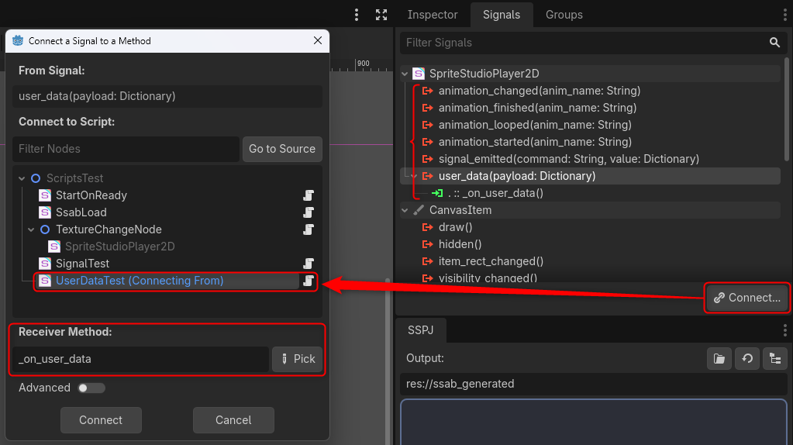
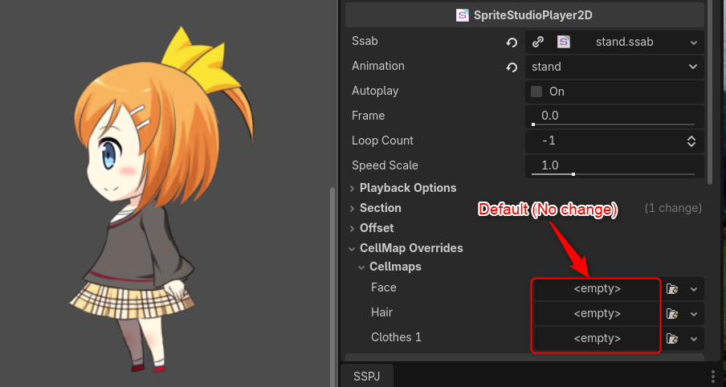
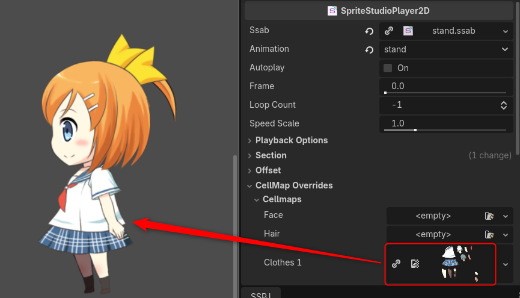

# Scripting and Event-Driven Control

This page explains how to control `SpriteStudioPlayer2D` using Godot's GDScript.
The intuitive API aligns with Godot's design philosophy (nodes and signals), making it very easy to integrate into your game logic.

---

## Intuitive Playback Control

Just like operating from the Inspector, you can control animations using simple method calls from your scripts.

```gdscript
extends Node2D

@onready var ss_player = $SpriteStudioPlayer2D

func _ready():
    # Specify the animation name
    ss_player.set_animation("attack")
    # Start playback
    ss_player.play()

func _process(delta):
    # Pause/Resume with the Space key
    if Input.is_action_just_pressed("ui_accept"):
        if ss_player.is_playing():
            ss_player.pause()
        else:
            ss_player.play()
```

---

## Implementing Event-Driven Logic with Signals

One of the most powerful features for Godot users is event linkage using "Signals".
`SpriteStudioPlayer2D` emits useful signals when its playback state changes or when user data is triggered.

### Key Signals

* `animation_changed(anim_name)`: Emitted when the animation is changed.
* `animation_started(anim_name)`: Emitted when animation playback starts.
* `animation_finished(anim_name)`: Emitted once every configured loop has been played (never under an infinite loop).
* `animation_looped(anim_name)`: Emitted when the animation loops and returns to the beginning.
* `user_data(payload)`: Emitted when reaching a frame containing user data (events) configured in the animation.

### Example: Sequential Animation Playback
Here is an example where an "idle" animation automatically plays after an "attack" animation finishes.

```gdscript
func _ready():
    # You can also connect via the editor UI (Node tab), but to do it via code:
    ss_player.animation_finished.connect(_on_animation_finished)

func _on_animation_finished(anim_name: String):
    if anim_name == "attack":
        # Return to idle state after the attack
        ss_player.set_animation("idle")
        ss_player.play()
```

> [!NOTE]
> 

### Example: Triggering Events using User Data
This is an example of receiving user data configured in SpriteStudio (such as playing footsteps or generating attack hitboxes) and processing it in the game.

```gdscript
func _ready():
    # Connect the user data signal
    ss_player.user_data.connect(_on_user_data)

func _on_user_data(payload):
    # payload is a Dictionary; only the keys that were set are present (string / integer / point / rect)
    # Example: Check the string set as user data and process accordingly
    if payload.get("string") == "play_footstep":
        $AudioStreamPlayer.play()
    elif payload.get("string") == "attack_hit":
        # Example of passing the damage amount using an integer value
        var damage = payload.get("integer", 0)
        spawn_hitbox(damage)
```

---

## Dynamic Texture Replacement (Avatar Customization)

When you want to change character equipment in-game, you can dynamically replace the texture of specific parts (cell maps) from your code.

### Example: Changing Outfits

```gdscript
func change_costume():
    # Use the cell map name defined in SpriteStudio (retrievable via get_cellmap_names(); shown under CellMap Overrides in the Inspector)
    var new_costume_texture = preload("res://assets/sailor_uniform.png")
    ss_player.set_cellmap_texture("Clothes 1", new_costume_texture)
```

This feature allows you to build an efficient avatar system without needing to prepare multiple animation variations for each part.

> [!TIP]
> 
> 

---

## Part Tracking (Following a Specified Part)

A feature that makes a user-provided node (weapon, effect, hit detection, etc.) follow a specified part every frame. The player neither creates nor frees nodes; it only writes the pose (constraint style), and you own the target's lifecycle.

Tracking is done with the dedicated **`SpriteStudioPartAttachment2D`** node. Place it as a child of `SpriteStudioPlayer2D` and set `part_name` to the part you want to follow. Anything you hang under that node — a weapon, an effect — follows along through scene-tree inheritance.

> **The properties follow Godot's own `RemoteTransform2D`**, plus `follow_path` / `part_name` to say which player and which part to read.

| Property | Description |
|---|---|
| **Part Name** (`part_name`) | The name of the part to follow (the PartData name in the `.ssab`). The inspector offers a dropdown populated from the asset's part names (still typable, for when the player cannot be resolved) |
| **Follow Path** (`follow_path`) | The `SpriteStudioPlayer2D` to read from. Empty (default) uses the **nearest ancestor** player |
| **Remote Path** (`remote_path`) | The `Node2D` to drive. Empty (default) drives this node itself, and its children follow through scene-tree inheritance. Set it to push the pose to an external node instead (for assets that live outside the player's subtree) |
| **Use Global Coordinates** (`use_global_coordinates`) | ON (default) writes the pose in global coordinates, OFF in the target's local coordinates |
| **Update Position / Update Rotation** (`update_position` / `update_rotation`) | Reflect position / rotation (both ON by default) |
| **Update Scale** (`update_scale`) | Reflect scale (OFF by default) |
| **On Part Hidden** (`on_part_hidden`) | Behavior on frames where the part is hidden. `Follow Always` (keep following; default) / `Hide Target` (hide the target) |

### Querying from a Script

Instead of placing a node, you can also ask the player for a part's pose directly.

```gdscript
@onready var ss_player = $SpriteStudioPlayer2D
@onready var muzzle = $Muzzle

func _ready():
    print(ss_player.get_part_names())    # -> ["root", "body", "hand_R", ...]

    # Emitted every time the frame's part poses are finalized
    ss_player.frame_updated.connect(_on_frame_updated)

func _on_frame_updated(frame_no: float):
    # get_part_transform() is player-local; multiply by the player's transform for global
    muzzle.global_transform = ss_player.global_transform * ss_player.get_part_transform("hand_R")
```

| API | Description |
|---|---|
| `get_part_names()` | Every part name in the asset (`.ssab`) |
| `get_part_index(part_name)` | Part index, or `-1` if the part is not in the asset |
| `get_part_transform(part_name)` | The part's transform for the current frame (a `Transform2D`, player-local, with `flip_h` / `flip_v` / `offset` already applied). Identity if the part is unknown |
| `is_part_hidden(part_name)` | Whether the part is hidden on the current frame. `false` if the part is unknown |
| signal `frame_updated(frame_no: float)` | Emitted right after the frame's part poses are finalized |

> When you only need the pose at a single moment (a projectile spawn point, for example) rather than continuous following, calling `get_part_transform()` directly is simpler than placing a `SpriteStudioPartAttachment2D`.

### Timing and Accuracy

Tracking is driven by the `frame_updated` signal the player emits right after finishing its own update. That is after the part transforms are finalized and before the render phase, so the target updates **within the same frame**. Which process it fires in follows the player's `animation_process_mode` (`Idle` (default) / `Physics`).

Godot's `Transform2D` holds a full 2x3 affine transform, so when `update_position` / `update_rotation` / `update_scale` are **all ON** the transform is assigned whole. That matches the part **exactly, including skew and negative scale**, whether the target sits under the player or in a separate hierarchy.

Turning any of them OFF writes only the enabled components individually, like `RemoteTransform2D`, and skew is not preserved. Only `update_scale` is OFF by default, so **position and rotation alone are reflected out of the box**.

> **Turn all three ON when you use `flip_h` / `flip_v`.** A flipped part's pose is a **mirror**, and a mirror can only be expressed as a negative scale. With `update_scale` OFF (the default) the mirror never reaches the target, and **`flip_h` (horizontal) additionally leaves a 180-degree difference in orientation** (`flip_v` does not). The two differ because `Transform2D` decomposes a mirror into a rotation plus a negative scale with the sign placed on the Y axis: a horizontal mirror needs an extra 180-degree rotation to fit that form, and it is the rotation that keeps it. `flip_h` / `flip_v` are not the only source — a part or one of its parents carrying a negative scale in SpriteStudio mirrors the pose the same way.
>
> **`get_part_transform()` itself stays exact when flipped.** `Transform2D` can hold the mirror as-is, so `get_rotation()` and `get_scale()` match the part exactly **as a pair** (the Y component of `get_scale()` goes negative when mirrored). Reading only one of them drifts, for the reason above.

> **A target in a separate hierarchy can lag by one frame.** The pose is written using the player's `global_transform` as sampled at drive time, so if you move the player afterwards, the target does not follow until the next frame. A `SpriteStudioPartAttachment2D` (and its children) placed under the player always follows, through hierarchy inheritance.

> **Do not track with a `RigidBody2D`.** Overwriting its transform every frame reads as a teleport to the solver and breaks the physics. If you need to push other bodies — a moving platform, say — target Godot's `AnimatableBody2D` (with `sync_to_physics` ON) and set the player's `animation_process_mode` to `Physics` so tracking is driven on the physics frame. To merely carry a hit box, `Area2D` / `StaticBody2D` is enough.

### Notes

- **The attachment controls the target's `visible`.** It is hidden automatically in the two cases below, and shown again automatically once the condition clears, so a visibility state you set yourself may be overwritten.
    - The part name does not exist in the asset (always hidden, regardless of the `On Part Hidden` setting)
    - The part is hidden on this frame and `On Part Hidden` is `Hide Target`
- Part names resolve against the parts of the `.ssab` the player itself has loaded. **Parts inside an Instance part (the child animation) cannot be specified** (the Instance part itself can).
- Part names resolve per asset (`.ssab`), independent of the animation. Swapping the `.ssab` re-resolves them automatically, so nothing has to be set up again.
- If several parts share a name, the first one found is used.
- Only the **spatial transform** is tracked. Draw order (Z order) is not, so a tracked node is never slotted automatically *between* SpriteStudio parts. Use `z_index` or similar when you need a specific ordering.
- Targets must be `Node2D`-based nodes. `Control` (UI) is laid out by anchors and rects and cannot be targeted.
- In the editor, tracking is applied as well whenever the player updates — during preview playback or while scrubbing frames.

---

## Part Overrides (Color / Cell / Visibility)

Per-part runtime overrides let a script say "make this part this color / this cell / hidden **now**". An override wins over both the keyframe and any animation blending, so it does not have to fight the animation.

```gdscript
@onready var ss_player = $SpriteStudioPlayer2D

func _ready():
    # Tint a part red (multiply). Applies to normal (image) parts.
    ss_player.set_part_color_override("body", Color.RED, 1)  # 1 = Mul

    # Or give each of the four corners its own color, for a gradient.
    ss_player.set_part_color_override_corners(
        "body", Color.RED, Color.RED, Color.BLUE, Color.BLUE, 0)

    # Make a part draw a different cell (cell map name is written without ".ssce").
    ss_player.set_part_cell_override("body", "Ringo", "effect3")

    # Force-hide a part, cascading to its descendants.
    ss_player.set_part_visibility_override("body", true, true)

    # Revert
    ss_player.clear_part_color_override("body")
    ss_player.clear_all_part_overrides()
```

| Method | Description |
|---|---|
| `get_part_index(part_name)` | Part index, or `-1` if the part is not in the asset |
| `set_part_color_override(part_name, color, blend_op = 0, priority = 1)` | Color override (single color) |
| `set_part_color_override_corners(part_name, left_top, right_top, left_bottom, right_bottom, blend_op = 0, priority = 1)` | Color override with a distinct color per corner (gradient) |
| `set_part_cell_override(part_name, cellmap_name, cell_name, priority = 1)` | Draw a different cell |
| `set_part_visibility_override(part_name, force_hidden, cascade = false)` | Force-hide (`force_hidden = false` reverts to the animation) |
| `clear_part_color_override` / `clear_part_cell_override` / `clear_part_visibility_override` | Clear one override on one part |
| `clear_all_part_overrides()` | Clear every override on the player |
| `*_by_index(part_index, ...)` | Part-index variant of each method above (skips the name lookup) |

Every method returns `false` when the part is unknown or the runtime rejects the call. A single color and a four-corner color share one override slot per part, so the last call wins and `clear_part_color_override()` clears either kind.

The cell map / cell names you can pass to a cell override are enumerated from the player:

```gdscript
print(ss_player.get_cellmap_names())        # -> ["Ringo", ...]
print(ss_player.get_cell_names("Ringo"))    # -> ["effect3", ...]
```

Both read the bound `SSABResource` and return an empty array when none is assigned. The same two methods are also available on the resource itself (`ss_player.get_ssab_resource().get_cellmap_names()`), which is the way to enumerate an `.ssab` you have not put on a player yet.

> **On choosing between a texture swap and a cell override**: `set_cellmap_texture()` in the previous section replaces a **whole cell map (texture)** at once, affecting every part that uses it. This feature instead replaces the cell that a **single part** draws. Pick whichever matches your intent.

> **On using part indices**: Part indices are stable within one asset (the same `.ssab`), so if you set overrides frequently, resolve the name once with `get_part_index()` and reuse that index with the `*_by_index()` variants.

### Blend operation (`blend_op`)

The `blend_op` of `set_part_color_override()` offers the same four operations as the keyframed Part Color.

| Value | Blend operation |
|---|---|
| `0` | Mix (default) |
| `1` | Mul (multiply) |
| `2` | Add |
| `3` | Sub (subtract) |

An out-of-range value fails the call and returns `false`.

### Priority mode (`priority`)

Color and cell overrides conflict with the animation, so they take a `priority` (visibility does not — it is a plain force-hide flag, and any new animation clears it):

| Value | Priority mode | Behavior |
|---|---|---|
| `0` | OverwriteOnNextKeyframe | The override applies until the animation data updates that attribute |
| `1` | HoldUntilNextAnimation (default) | The override wins for the current animation and is cleared when a new animation is set up |
| `2` | Permanent | The override applies for as long as the same animation data (`.ssab`) is playing, surviving animation changes |

### Notes

- **Color** applies to normal parts, **cell** to normal and mask parts; other part types silently ignore the override (the call still returns `true`).
- Colors are interpreted in the same 8-bit sRGB space as the authored Part Color, and alpha is pre-multiplied by the runtime — pass the color as authored, without converting it yourself.
- A cell override is resolved when you set it, so an unknown cell map / cell name fails immediately (returns `false`).
- Overrides live on the runtime, which owns their lifecycle. Do not re-apply them after an animation change; choose the priority mode that expresses what you want instead.
- Assigning a different `.ssab` resource clears every override, because part identity is lost.
- Overrides do not reach parts **inside** an instance part (the child animation runs as a separate player). Force-hiding the instance part itself does stop its contents from being drawn.

> **On when an override is not reflected in the drawing**: While playback is stopped or paused — or on any frame that does not advance — the drawing is not rebuilt, so setting or clearing an override will not appear on screen. Call `set_frame(get_frame())` to force a redraw when you need it reflected immediately.
