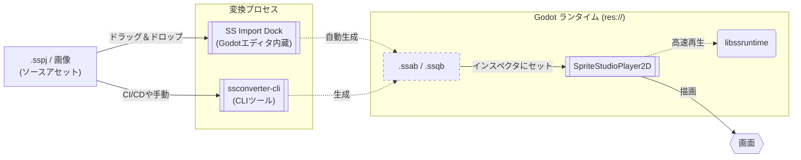

# SpriteStudioPlayer for Godot

本developブランチは現在開発中のバージョンです。  
安定版は [mainブランチ](https://github.com/SpriteStudio/SSPlayerForGodot/tree/main) または、[Releases](https://github.com/SpriteStudio/SSPlayerForGodot/releases)から取得してください。  
本developブランチに関してはいかなる保証もサポートも提供しません。リクエストやバグ報告への返信もできません。  
インターフェースは予告なく変更される可能性があります。

[OPTPiX SpriteStudio](https://www.webtech.co.jp/spritestudio/) で作成したアニメーションを [Godot Engine](https://godotengine.org/) 上で再生するためのプラグインです。
再生処理は [SpriteStudio-SDK](https://github.com/cri-middleware/SpriteStudio-SDK) が提供する `libssruntime` を介して行います。

## 目次

- **セットアップ**
    - [インストール](setup/install.md)
    - [ビルドガイド](setup/build.md)
- **ワークフロー**
    - [基本的な使い方](workflow/usage_basic.md)
    - [AnimationPlayer との連携](workflow/animation_player.md)
    - [アセットのインポートとエディタ連携](workflow/usage_asset_pipeline.md)（初回の `.sspj` インポートはこちら）
    - [スクリプト制御とイベント](workflow/usage_scripting.md)
- **応用**
    - [CLI コンバートと自動化](workflow/import.md)
    - [パフォーマンスチューニングと高度な設定](workflow/tips.md)
- **API リファレンス**
    - [SpriteStudioPlayer2D](api/player.md)
    - [リソース管理クラス](api/resource.md)
- [v1.x からのマイグレーション](migration_from_v1.md)

## 主な機能 (Key Features)

本プラグインは、Godot Engine 上で SpriteStudio 7 の表現力をフルに引き出すために設計されています。

*   **完全な機能サポート:** ボーン階層、メッシュ＆デフォーム、パーティクルエフェクトなど、SpriteStudio 7 の全機能を標準でサポートします。
*   **シームレスな統合と強力なアセットパイプライン:** Godot のエディタ内に統合された「SS Import Dock」による簡単なインポートに加え、インスペクタから直接 SpriteStudio を開いて再コンバートできる、**SpriteStudio と Godot をシームレスに行き来できる強力なアセットパイプライン**を提供します。詳しくは [アセットのインポートとエディタ連携](workflow/usage_asset_pipeline.md) をご覧ください。
*   **動的な着せ替え (CellMap Overrides):** 実行時にテクスチャ（セルマップ）を差し替えることで、キャラクターのカラーバリエーションや装備変更を簡単に実装できます。
*   **シグナルとイベント:** タイムライン上に設定した「ユーザーデータ」や「シグナル」を Godot のシグナルとして受け取り、足音の再生やスクリプトのトリガーを正確なタイミングで行えます。
*   **滑らかなスローモーション:** サブフレーム補間（Sub-frame interpolation）をサポートし、高リフレッシュレートのモニターやスローモーション演出でもカクつかない滑らかな再生が可能です。
*   **超高速・省メモリ:** バックエンドの `libssruntime` による SIMD 最適化と、パース不要なバイナリ形式（`.ssab`）により、モバイルなどのリソースが限られた環境でも多数のキャラクターを高速に描画します。

## 概要 (Overview)

本プラグインを利用してアニメーションを再生する際の流れを以下に示します。

## 対応バージョン

- **Godot Engine**: [4.6 ブランチ](https://github.com/godotengine/godot/tree/4.6)
- **godot-cpp**: [master ブランチ](https://github.com/godotengine/godot-cpp/tree/master)

> [!NOTE]
> GDExtension は Godot 4.6 以降から正式サポートされます。

Windows / macOS でのビルドおよび実行を確認しています。

## サンプル

リポジトリの `examples/` フォルダに SDK のテストプロジェクトに基づいたサンプルプロジェクトがあります。

- [Ringo](../../examples/Ringo) — 「りんご」のテスト
- [allAttributeV7](../../examples/allAttributeV7) — 全属性の機能テスト
- [allPartsV7](../../examples/allPartsV7) — 全パーツ種の機能テスト
- [overall](../../examples/overall) — 総合的な機能テスト
- [overall_gdextension](../../examples/overall_gdextension) — GDExtension 版での総合テスト
- [ParticleEffect](../../examples/ParticleEffect) — エフェクト機能のテスト

## 関連リポジトリ

- [SpriteStudio-SDK](https://github.com/cri-middleware/SpriteStudio-SDK) — `libssruntime` / `libssconverter` を提供する SDK 本体

## マイグレーション

v1.x 以前のバージョンからの移行手順については、[マイグレーションガイド](migration_from_v1.md) を参照してください。

## ライセンス

[LICENSE.md](../../LICENSE.md) を参照してください。

