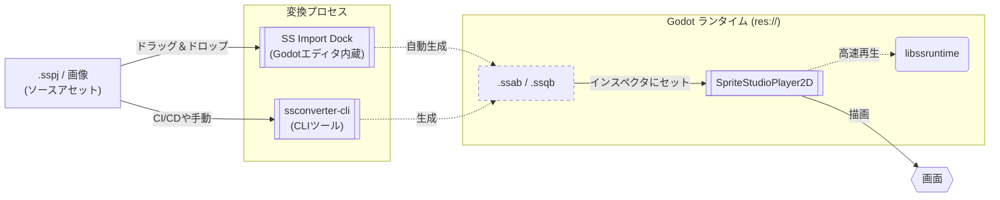

# 🕹️ SpriteStudioPlayer for Godot

本developブランチは現在開発中のバージョンです。  
安定版は [mainブランチ](https://github.com/cri-middleware/SSPlayerForGodot/tree/main) または、[Releases](https://github.com/cri-middleware/SSPlayerForGodot/releases)から取得してください。  
本developブランチに関してはいかなる保証もサポートも提供しません。リクエストやバグ報告への返信もできません。  
インターフェースは予告なく変更される可能性があります。

[SpriteStudio](https://www.webtech.co.jp/spritestudio/) で作成したアニメーションを [Godot Engine](https://godotengine.org/) 上で再生するためのプラグインです。
再生処理は [SpriteStudio-SDK](https://github.com/cri-middleware/SpriteStudio-SDK) が提供する `libssruntime` を介して行います。

## 目次

- **セットアップ**
    - [インストール](setup/install.md)
    - [ビルドガイド](setup/build.md)
- **ワークフロー**
    - [基本的な使い方](workflow/usage_basic.md)
    - [AnimationPlayer との連携](workflow/animation_player.md)
    - [アセットのインポートとエディタ連携](workflow/usage_asset_pipeline.md)（初回の `.sspj` インポートはこちら）
    - [スクリプト制御とイベント](workflow/usage_scripting.md)
    - [サウンド再生](workflow/audio.md)
    - [プロジェクトのエクスポート](workflow/export.md)
- **応用**
    - [CLI コンバートと自動化](workflow/import.md)
    - [パフォーマンスチューニングと高度な設定](workflow/tips.md)
- **API リファレンス**
    - [SpriteStudioPlayer2D](api/player.md)
    - [リソース管理クラス](api/resource.md)
- [トラブルシューティング](troubleshooting.md)
- [仕様と制約事項](limitations.md)
- [v1.x からのマイグレーション](migration_from_v1.md)
- **ライセンス**
    - [ライセンス](license.md)
    - [サードパーティライセンス](third_party_notices.md)

## 主な機能 (Key Features)

本プラグインは、Godot Engine 上で SpriteStudio の表現力をフルに引き出すために設計されています。

*   **完全な機能サポート:** ボーン階層、メッシュ＆デフォーム、パーティクルエフェクトなど、SpriteStudio の全機能を標準でサポートします。
*   **シームレスな統合と強力なアセットパイプライン:** Godot のエディタ内に統合された「SS Import Dock」による簡単なインポートに加え、インスペクタから直接 SpriteStudio を開いて再コンバートできる、**SpriteStudio と Godot をシームレスに行き来できる強力なアセットパイプライン**を提供します。詳しくは [アセットのインポートとエディタ連携](workflow/usage_asset_pipeline.md) をご覧ください。
*   **動的な着せ替え (CellMap Overrides):** 実行時にテクスチャ（セルマップ）を差し替えることで、キャラクターのカラーバリエーションや装備変更を簡単に実装できます。
*   **シグナルとイベント:** タイムライン上に設定した「ユーザーデータ」や「シグナル」を Godot のシグナルとして受け取り、ゲームロジックのトリガーを正確なタイミングで行えます。どのパーツが発火したかも各イベントが持っています。
*   **そのまま鳴るサウンド:** サウンドパートは設定なしで Godot 上から鳴ります（エディタプレビュー中も同様）。音量を調整する、`audio` シグナルで自前処理に切り替える、[バックエンドリソース](workflow/audio.md) で全サウンドをオーディオミドルウェアへ流す、といった対応が可能です。
*   **パーツ単位のエフェクト:** SpriteStudio のアドオンシェーダ 13 種（セピア / 輪郭線 / HSB / ブラー / モザイク / ウェーブ / ノイズ ほか）をネイティブに再現します。SpriteStudio 側で設定するだけで、Godot 側の作業はありません。
*   **滑らかなスローモーション:** サブフレーム補間（Sub-frame interpolation）をサポートし、高リフレッシュレートのモニターやスローモーション演出でもカクつかない滑らかな再生が可能です。
*   **超高速・省メモリ:** バックエンドの `libssruntime` による SIMD 最適化と、パース不要なバイナリ形式（`.ssab`）により、モバイルなどのリソースが限られた環境でも多数のキャラクターを高速に描画します。

## 概要 (Overview)

本プラグインを利用してアニメーションを再生する際の流れを以下に示します。

## 対応バージョン

- **Godot Engine**: [4.7 ブランチ](https://github.com/godotengine/godot/tree/4.7)
- **godot-cpp**: [master ブランチ](https://github.com/godotengine/godot-cpp/tree/master)

> [!NOTE]
> GDExtension は Godot 4.7 以降から正式サポートされます。

Windows / macOS でのビルドおよび実行を確認しています。

## サンプル

リポジトリの `examples/` フォルダに SDK のテストプロジェクトに基づいたサンプルプロジェクトがあります。

- [Ringo](https://github.com/cri-middleware/SSPlayerForGodot/tree/main/examples/Ringo) — Ringo用の基本クイックスタートテスト
- [Scripting](https://github.com/cri-middleware/SSPlayerForGodot/tree/main/examples/Scripting) — GDScriptを用いたアニメーション制御やシグナル受信のサンプル
- [Override_Ringo](https://github.com/cri-middleware/SSPlayerForGodot/tree/main/examples/Override_Ringo) — アトリビュート・マテリアルのオーバーライドサンプル
- [overall](https://github.com/cri-middleware/SSPlayerForGodot/tree/main/examples/overall) — 総合的な機能テスト（カスタムモジュール版）
- [overall_gdextension](https://github.com/cri-middleware/SSPlayerForGodot/tree/main/examples/overall_gdextension) — 総合的な機能テスト（GDExtension版）

## 関連リポジトリ

- [SpriteStudio Docs](https://cri-middleware.github.io/SpriteStudio-Docs/ja/) — SDK と公式 Player のドキュメントポータル。
- [SpriteStudio-SDK](https://github.com/cri-middleware/SpriteStudio-SDK) — `libssruntime` / `libssconverter` を提供する SDK 本体。
- [SSConverterGUI](https://github.com/cri-middleware/SSConverterGUI) — Player を介さず `.sspj` を変換するデスクトップ GUI。

## マイグレーション

v1.x 以前のバージョンからの移行手順については、[マイグレーションガイド](migration_from_v1.md) を参照してください。

## ライセンス

[ライセンス](license.md) を参照してください。

サードパーティライブラリ（FlatBuffers, SpriteStudio-SDK の依存クレートなど）のライセンスについては、[サードパーティライセンス](third_party_notices.md) を参照してください。

