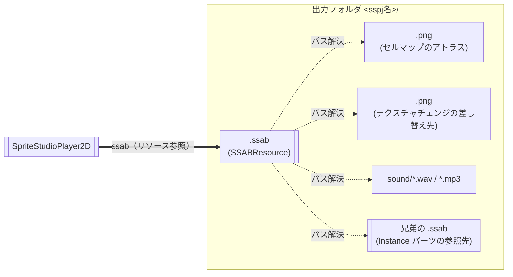

# 📦 生成アセットの構成とエクスポート / 追加配信

[← ドキュメント目次へ戻る](../index.md)

`.sspj` を変換すると、出力フォルダに複数のファイルが生成されます。このページでは、**エクスポートや `.pck` による追加配信で、どこまでを 1 つのまとまりとして運ぶか**を決めるために必要な情報 — ファイルどうしの依存関係、**その依存を Godot エディタが追えないこと**、再コンバートが何を上書きして何を残すのか — をまとめます。

インポートの手順そのものは [アセットのインポートとエディタ連携](usage_asset_pipeline.md)、エクスポート先ごとの設定は [プロジェクトのエクスポート](export.md) を参照してください。

---

## SpriteStudio 側のファイルと出力の対応

`.sspj` を渡されて Godot 側を担当する場合、まず押さえるのは **SpriteStudio 側のどのファイルが、変換後のどれになるのか** です。`.sspj` / `.ssae` / `.ssce` / `.ssqe` それぞれの役割と変換後の対応は、Player 共通の話なのでポータルにまとめてあります。

> [!NOTE]
> [SpriteStudio Docs: アセットの変換 — プロジェクトの構成と、変換後の対応](https://cri-middleware.github.io/SpriteStudio-Docs/ja/overview/conversion/#プロジェクトの構成と変換後の対応)
>
> 要点は 2 つです。**`.ssae` 1 本が `.ssab` 1 本**になること、そして **セルの切り出し位置は `.ssce` から `.ssab` へ焼き込まれる**こと。後者が、下の「画像だけ差し替えられるか」の判断を決めます。

### SpriteStudio 側の作業と、更新される出力

| SpriteStudio 側でしたこと | 更新される出力 | 配信するとき |
|---|---|---|
| 画像を描き替えただけ（切り出しは触らない） | `.png` のみ | 画像を含むパックだけ差し替えれば反映されます |
| セルの追加・移動・サイズ変更、画像サイズの変更（`.ssce` が変わる） | `.png` と `.ssab` | **両方を同時に配信**してください。片方だけだと絵がずれます |
| アニメーションの修正（`.ssae`） | 該当する `.ssab` | その `.ssab` を含むパック |
| アニメパックの追加 | `.ssab` が 1 本増える | 新しいファイルもパックに含まれるようにします |
| シーケンスの修正（`.ssqe`） | `.ssqb` | 現状、ゲーム内の挙動は変わりません |

---

## 生成されるファイル

`.sspj` 1 本を変換すると、出力フォルダ（既定 `res://ssab_generated`）の下に `<sspj名>/` フォルダが作られ、次のように並びます。

```text
res://ssab_generated/overall/
├── Basic.ssab                  ← アニメパックごとに 1 本
├── Effect.ssab
├── Instance.ssab
├── …
├── sequence.ssqb               ← .ssqe ごとに 1 本
├── common.png                  ← アトラス画像
├── common_2.png
├── box_00_00.png
├── font/
│   └── RoundedMPlus_0.png      ← サブフォルダの構成も保たれます
└── sound/
    ├── test.mp3
    └── WAV_16khz_mono_256kbps_s16.wav
```

| ファイル | 生成元 | Godot 上の実体 | 何を持っているか |
|---|---|---|---|
| `<アニメパック名>.ssab` | `.ssae` 1 本につき 1 ファイル | `SSABResource` | アニメーション（キーフレーム）、パーツ構成、**セルマップ（アトラス上の切り出し矩形・ピボット・元画像サイズ）**、エフェクト定義、ユーザーデータ／シグナル、参照テクスチャ名、サウンド参照 |
| `<シーケンスパック名>.ssqb` | `.ssqe` 1 本につき 1 ファイル | `SSQBResource` | アニメーションの再生順（シーケンス）。再生には未対応です（[仕様と制約事項](../limitations.md)） |
| `<テクスチャ名>.png` ほか | `.sspj` が参照する画像 | `Texture2D`（Godot が `.import` を作り `.ctex` へ変換） | 絵柄そのもの（アトラス画像） |
| `sound/<音声ファイル>` | `.sspj` が参照するサウンド | `AudioStream` | サウンドパートが鳴らす音声（[サウンド再生](audio.md)） |

> [!NOTE]
> **マテリアルもシェーダーもプロジェクトには生成されません。**
> Godot 版のシェーダーはプラグインのネイティブライブラリに埋め込まれていて、描画に使うマテリアルは実行時に組み立てられます。`res://` に置かれるのは上の 4 種類だけで、エクスポートで気にするのもこれだけです。

> [!TIP]
> **出力先はプロジェクト内のどこでも構いません**
> `res://ssab_generated` は既定値にすぎません。SS Import Dock の出力先には `res://` 配下の任意のフォルダを指定でき、その値はプロジェクト直下の `.ssplayer_sources.cfg` に入るため、**チームで同じ出力先を共有できます**。
>
> ただし **`.ssab` と画像・`sound/` の相対位置は保ってください**。下記のとおり参照は `.ssab` 自身のディレクトリを基準にしたパスなので、フォルダの中身を分けて配置すると解決に失敗します。生成後にフォルダごと移動すること自体はできますが、`.sspj` とのひも付けは追従しません（再リンクの手順は [アセットのインポートとエディタ連携](usage_asset_pipeline.md) の「制限事項とチーム開発時の注意点」にあります）。

---

## 依存関係



- **リソース参照は太線の 1 本だけです。** シーンが保持するのは `.ssab` への参照だけで、そこから先は**すべて実行時のパス解決**です。`.ssab` 自身のディレクトリを基準に `res://` のパスを組み立て、`ResourceLoader` へ渡しています。
- 解決されるのは 4 種類です。**セルマップのアトラス**、**テクスチャチェンジ（TCHG）の差し替え先テクスチャ**、**`sound/` 配下の音声**、そして **Instance パーツが再生する `.ssab`**（`<アニメパック名>.ssab` として**同じフォルダ**を見ます）。
- 画像パスはサブフォルダを含むことがあります（上の例の `font/RoundedMPlus_0.png`）。`.ssab` からの相対位置ごと運んでください。
- 裏を返すと、Unity の Addressables のように「明示登録しなかった依存が各バンドルへ複製される」ことはありません。所定の `res://` パスに 1 つあれば、参照している全員がそれを見ます。

> [!IMPORTANT]
> **Godot エディタはこの依存関係を知りません。**
> `SSABResource` は依存リストを申告しないため、エディタのファイルシステムが持つ依存キャッシュは `.ssab` について**空**です。依存グラフに乗っている前提の機能はすべて空振りします —— FileSystem ドックでファイルを移動・削除するときの依存追跡も、次に述べるエクスポートモードもです。

---

## エクスポートモードの選び方

**プロジェクト → エクスポート… → リソース** タブの **エクスポートモード** が、生成アセットの生死を分けます。

| エクスポートモード | 生成アセットの扱い |
|---|---|
| **プロジェクト内のリソースをすべてエクスポート**（既定） | ✅ プロジェクト内のファイルを一律に含めるため、`.ssab`・画像・サウンドがすべて入ります |
| **プロジェクト内のリソースを、下でチェックしたものを除きすべてエクスポート** | ✅ 同上（明示的に外したものを除く） |
| **選択したシーン(と依存関係にあるもの)をエクスポート** | ⚠️ **依存をたどって集めるモードです。**`.ssab` はシーンから参照されているので入りますが、**画像・サウンド・Instance の参照先 `.ssab` は入りません** |
| **選択したリソース(と依存関係にあるもの)をエクスポート** | ⚠️ 同上 |

> [!WARNING]
> 依存ベースのモードで書き出すと、**エクスポートは成功し、アプリも起動し、絵だけが出ません。**
> テクスチャの解決に失敗しても再生は止まらず、パーツはテクスチャなしのまま描かれます。画面を見るまで気づけない類の壊れ方なので、既定の **プロジェクト内のリソースをすべてエクスポート** のまま使うか、依存ベースのモードを使う場合は出力フォルダを**除外フィルタで落とさないよう**確認してください。

---

## 再コンバートで上書きされるもの・されないもの

| 対象 | 再コンバートしたとき |
|---|---|
| `.ssab` / `.ssqb` / 画像 / サウンド | **上書き**されます。ファイルを削除せず書き換えるため、画像の `.import`（インポート設定・UID）はそのまま残ります |
| 別の `.sspj` が所有する出力フォルダに当たった場合 | 上書きの前に確認ダイアログ（*Output name collision*）が出ます。同じ `.sspj` の再コンバートでは出ません |
| `.sspj` から削除された画像・アニメパック | 出力フォルダに**古いファイルが残ります**。不要であれば手動で削除してください |

---

## `.pck` による追加配信

Godot の追加配信は `.pck` です。**プロジェクト → エクスポート… → PCK/Zip をエクスポート** で作り、実行時に [`ProjectSettings.load_resource_pack()`](https://docs.godotengine.org/ja/latest/classes/class_projectsettings.html#class-projectsettings-method-load-resource-pack) でマウントします。

パックの中身は `res://` の同じパスに乗るため、**パス解決はパック越しでもそのまま通ります**。エクスポート時に画像が `.ctex` へ変換されていても、パックが対応する `.remap` を一緒に運ぶので変わりません。

```gdscript
if ProjectSettings.load_resource_pack("user://dlc/characters.pck"):
    var ssab: SSABResource = load("res://ssab_generated/Ringo/Ringo.ssab")
    $SpriteStudioPlayer2D.ssab = ssab
```

設計上の判断はひとつだけ、**「どの粒度で差し替えたいか」** です。

| 分け方 | 向いているケース | 注意点 |
|---|---|---|
| **A. `<sspj名>/` フォルダを丸ごと 1 パック** | まず動かす場合。キャラクター単位でまとめて更新する | 絵の修正だけでもフォルダ全体を配信することになります |
| **B. 画像だけを別パックにする** | 差分配信で見た目だけを更新したい | アトラス配置と画像サイズを変えないこと（変えるなら `.ssab` も同時更新）。**両方のパックがマウント済みであること**が前提になります |

### 見た目だけを差し替える手順（パターン B）

1. 画像を別パックへ分けてビルドし、本体と一緒に配信します。
2. 絵を描き替え、SpriteStudio 側でリロードして `.sspj` を保存します。
3. Godot で対象の **Reconvert** を実行します（SS Import Dock への再ドロップでも同じです）。画像は上書きされ、`.import` が維持されるためインポート設定も変わりません。
4. 画像のパックだけを再ビルドして配信します。

> [!WARNING]
> この差し替えが成立するのは、**アトラスの切り出し位置・サイズ・画像全体のサイズが変わらないとき**だけです。SpriteStudio 側でセルを追加・移動したり画像サイズを変えたりした場合、切り出し矩形を持つ `.ssab` が古いままだと絵がずれます。その場合は `.ssab` を含むパックも併せて更新してください。
