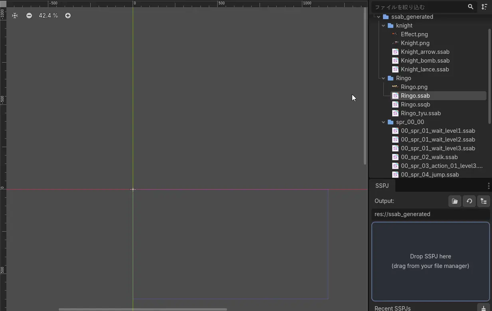
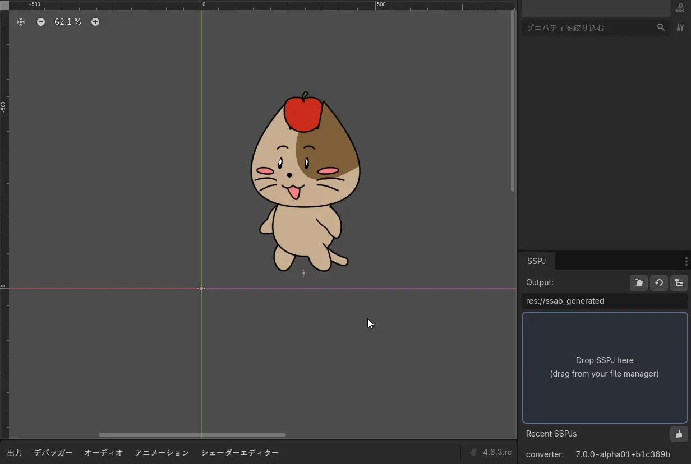
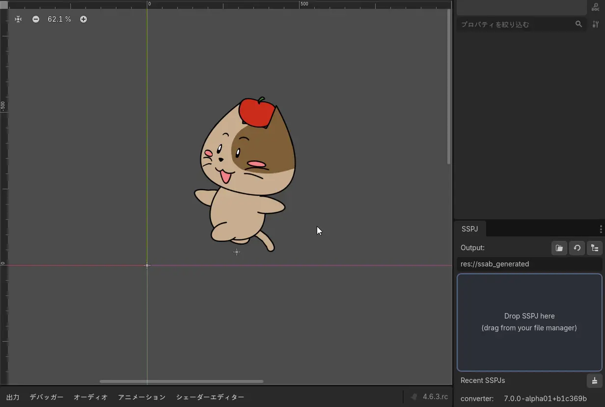

# ▶️ 基本的な使い方

このページでは、Godot のシーン上に SpriteStudio のアニメーションを配置して再生するまでの基本的な手順を解説します。

> [!NOTE]
> 本ページは **`.ssab` ファイルがすでに Godot プロジェクトにインポート済みであること** を前提としています。まだ `.ssab` が無い場合は、先に [アセットのインポートとエディタ連携](usage_asset_pipeline.md)（エディタからの取り込み）または [CLI コンバートと自動化](import.md)（CLI からの取り込み）を参照してください。

## 最速セットアップ: ドラッグ＆ドロップによるノード生成

Godot エディタの強力な機能を活かし、最短の手順でアニメーションをセットアップできます。

1. **ファイルシステムドック**から、インポート済みの **`.ssab` ファイル** を探します。
2. そのファイルを **2D ワークスペース (シーンビュー)** へドラッグ＆ドロップします。

これだけで自動的に `SpriteStudioPlayer2D` ノードがシーンに追加され、リソースの割り当ても完了します。

> [!TIP]
> 
> <video autoplay loop muted playsinline width="100%">
>   <source src="../assets/3-setup_drag_and_drop.webm" type="video/webm">
> </video>
> 

---

## 手動でのノード追加とアタッチ

既存のノード階層の特定の場所に配置したい場合は、手動でノードを追加してリソースを割り当てることも可能です。

1. シーンドックの「＋」ボタンなどから、`SpriteStudioPlayer2D` ノードをシーンツリーに追加します。
2. 追加したノードを選択し、インスペクタを開きます。
3. インスペクタの **`Ssab`** プロパティへ、ファイルシステムドックから `.ssab` ファイルをドラッグ＆ドロップしてアタッチします。

---

## インスペクタでの設定とプレビュー

ノードを選択すると、Godot のインスペクタから各種設定を行えます。

1. **`Animation` の選択**
   インスペクタの `Animation` プロパティのドロップダウンを開くと、`.ssab` に含まれるアニメーションのリストが表示されます。再生したいアニメーション名を選択してください。

> [!TIP]
> 
> <video autoplay loop muted playsinline width="100%">
>   <source src="../assets/4-inspector_preview-1.webm" type="video/webm">
> </video>
> 

2. **エディタ上でのプレビュー**
   ノードを選択すると **SpriteStudio** ボトムパネルが表示されます。先頭から再生 / 現在位置から再生 / 停止のトランスポート、フレームスクラバ、および隣の **Loop** / **Speed** を使って、**ゲームを実行せずにエディタ上でアニメーションを再生**できます。ショートカットは AnimationPlayer エディタと同じく **D** 現在位置から再生 / **Shift+D** 先頭から / **S** 停止（パネルが表示中に有効）。
   `Frame` や `Speed`、`Loop` などのパラメータを変更するとリアルタイムにプレビューへ反映されるため、素早い調整が可能です。

> [!TIP]
> 
> <video autoplay loop muted playsinline width="100%">
>   <source src="../assets/4-inspector_preview-2.webm" type="video/webm">
> </video>
> 

---

## 主なインスペクタプロパティ

| プロパティ                | 型     | 説明                                                                |
| -------------------------- | ------ | ------------------------------------------------------------------- |
| `Ssab`           | Resource | 再生対象の `SSABResource` (`.ssab` ファイル)                     |
| `Animation`                | String | 選択中のアニメーション名                                            |
| `Autoplay`                 | bool   | ゲーム開始時に自動再生するかどうか                                  |
| `Offset`                   | Vector2| 描画位置のオフセット。Transformを動かさずに見た目だけをずらす際に便利 |
| `Flip H / Flip V`          | bool   | アニメーションの水平 / 垂直反転                                     |
| `Frame`                    | float  | 現在のフレーム位置                                                  |
| `Speed Scale`              | float  | 再生速度倍率 (既定: 1.0)                                            |
| `Frame Rate`               | int    | FPS                                                                 |
| `Loop Count`               | int    | ループ回数 (`-1` で無限ループ)                                      |
| `Animation Section Start` | int    | 部分再生の開始フレーム                                              |
| `Animation Section End`   | int    | 部分再生の終了フレーム                                              |
| `Playback Direction`       | int    | 再生方向                                                            |
| `Playback Style`           | int    | 再生スタイル (片道/往復 等)                                         |
| `Frame Skip Enabled`       | bool   | 描画間隔がフレーム間隔を超えた際にフレームを飛ばすか                |
| `Sub Frame Enabled`        | bool   | サブフレーム補間を有効化するか                                      |
| `Animation Process Mode`   | int    | `_physics_process` (Physics) / `_process` (Idle) の同期設定、または `advance()` に委ねる (Manual) |
| `Play Audio`               | bool   | アニメーションのサウンドパートを内蔵プレイヤーで鳴らすか（[サウンド再生](audio.md) 参照） |
| `Audio Volume`             | float  | 内蔵サウンド再生のリニア音量 `[0, 1]`                               |
| `Audio Backend`            | Resource | 内蔵サウンド再生を置き換える `SpriteStudioAudioBackend`（任意）    |

---

## マスクパーツへの対応

本プラグインは SpriteStudio の「マスク機能（Mask）」にも完全対応しています。
特別な設定は必要なく、`.ssab` ファイルにマスクパーツが含まれていれば、Godot 上でも自動的にクリッピング処理が行われます。
描画は内部のバッチ処理と Godot の描画パイプラインで自動的に完結するため、ユーザー側で特定のマテリアルを割り当てたり、CanvasItem の `clip_children` を手動設定する必要はありません。そのままシーンに配置してお使いいただけます。
